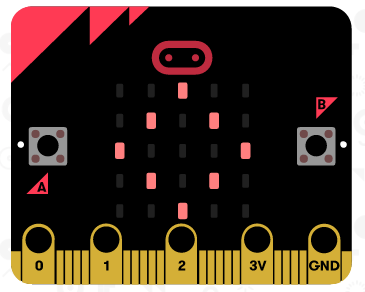

## عرض صورة

لنبدأ بإظهار صورة على جهاز micro:bit عندما يكون قيد التشغيل.

+ اذهب إلى <a href="https://rpf.io/microbit-new" target="_blank">rpf.io/microbit-new</a> لبدء مشروع جديد في محرر MakeCode (PXT). ادع مشروعك الجديد 'علامة تفاعلية'.

+ يجب أن ترى الآن محرر التعليمات البرمجية. لرسم صورة على جهاز micro: bit عند تشغيله ، اسحب تعليمة برمجية` مصابيح Led للإضاءة ` من منطقة التعليمات البرمجية (على اليسار) داخل التعليمات البرمجية ` اساسي`.

+ لإنشاء صورة للعرض ، انقر فوق المصابيح التي تريدها أن تضيء:

+ سيتم تشغيل التعليمات البرمجية الخاصة بك تلقائيًا في المحاكي على اليسار:

+ يمكنك أيضا اختبار تعليماتك البرمجية على المايكروبيت (micro:bit) نفسها! للقيام بذلك ، انقر فوق "تنزيل" في القائمة على يسار الشاشة.

سيؤدي هذا إلى إنشاء وتنزيل ملف `.hex` الذي سيتم تشغيله على المايكروبيت (micro:bit).

+ استخدم كابل USB لتوصيل المايكروبيت (micro:bit) في الحاسوب الخاص بك. من المفترض أن ترى بعد ذلك جهاز micro: bit يظهر في إدارة ملفات الحاسوب كمحرك أقراص USB. 

+ إذا كنت تستخدم أداة تحميل المايكروبيت (micro:bit) فسيتم نسخ الملف `.hex` تلقائياً إلى المايكروبيت (micro:bit). استشر متطوعك إذا لم تكن متأكدًا. 

وإلا ستحتاج إلى نسخ الملف `.hex` إلى المايكروبيت (micro:bit).

إذا كنت تستخدم **Internet Explorer** يمكنك اختيار `حفظ كـ ` من القائمة التي تظهر في أسفل المتصفح الخاص بك ثم اختر محرك الأقراص micro:bit:

إذا كنت تستخدم **Google Chrome** يمكنك النقر على السهم بعد الملف الذي تم تنزيله واختيار 'إظهار في المجلد' ثم سحب الملف المميز إلى محرك الأقراص (micro:bit):

+ سيضيء ضوء على الجزء الخلفي من المايكروبت الخاص بك أثناء نسخ الملف. بمجرد توقف هذا سيتم تشغيل البرنامج الخاص بك. يمكنك النقر فوق زر إعادة الضبط على الجزء الخلفي من micro: bit لإعادة تشغيل البرنامج.

+ يجب أن ترى الآن صورتك على المايكروبيت (micro:bit). إذا كنت تفضل ، يمكنك إزالة كابل USB من المايكروبيت (micro:bit) ، وإرفاق البطارية. سيتم حفظ البرنامج على المايكروبيت (micro:bit).

لا تحتاج إلى حساب Trinket لحفظ مشاريعك! سيتم حفظ مشروعك تلقائيًا في المتصفح ، يمكنك النقر فوق ` مشروعات ` لرؤية مشاريعك.

يمكنك أيضًا النقر على الحفظ لتحميل مشروعك كملف `.hex` الذي يحتوي على مشروعك:

لتحميل مشروعك على حاسوب آخر ، انقر فوق "مشاريع" ثم "استيراد ملف" وحدد <x>.x </code> ملف.

