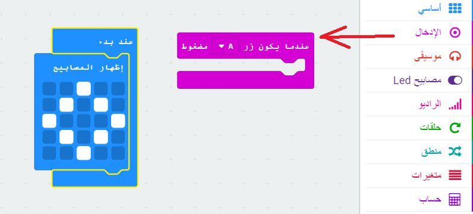

## عرض وجه سعيد

دعونا نعرض وجها سعيدا على المايكروبيت (micro:bit) عندما يتم الضغط على الزر 'A'.

+ حتى الآن ، قمت بتشغيل التعليمات البرمجية فقط عند تشغيل micro: bit. يمكنك أيضًا تشغيل التعليمات البرمجية عند الضغط على زر.

اسحب تعليمة "الضغط على الزر" من الإدخال وتأكد من تحديد "A":

أي تعليمة مضافة داخل هذه الكتلة سيتم تشغيله عند الضغط على الزر 'A' على المايكروبيت (micro:bit).

+ اسحب تعليمة أخرى `إظهار الدفاتر` التعليمة الجديد الخاص بك، وأرسم نمط الوجه السعيد.

+ اختبر تعليماتك البرمجية الجديدة في المحاكي. اضغط على الزر 'A' وسترى وجها سعيدا على المايكروبيت (micro:bit):

يمكنك أيضًا اختبار تعليماتك البرمجية الجديدة على المايكروبيت (micro:bit).