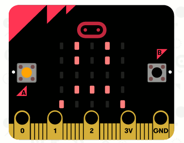

## إنشاء رسوم متحركة بسيطة

دعونا ننشئ رسوم متحركة بسيطة لوجوهك السعيدة و الحزينة.

+ أضف تعليمة أخرى `المصابيح` إلى تعليمة`اضغط على الزر A` مع وجه محايد.

+ إذا قمت بتشغيل هذه التعليمات البرمجية لاختبارها، ستلاحظ أن النمط يتغير بسرعة. للحصول على تأخير أطول، ستحتاج إلى إضافة تعليمة`توقف` بين الصورتين المعروضتين.

لاختيار عدد أجزاء ثانية التي يجب انتظارها، انقر على السهم الأسفل وأدخل رقما. 1000 جزء من الثانية هي ثانية واحدة، و 250 جزء من الثانية هي ربع ثانية.

+ ستحتاج أيضًا إلى تحريك وجهك الحزين. أسهل طريقة للقيام بذلك هي تكرار التعليمات التي أنشأتها للتو. انقر بزر الماوس الأيمن على تعليمة لتكرارها. لاحظ أن محرر PXT يكرر فقط تعليمة واحدة في كل مرة (ليس تعليمة متعددة مثل سكراتش)

+ للقيام بذلك ، اسحب مجموعة الضغط على `على الزر A + B` منع. هذا ما ينبغي ان تبدو عليه تعليماتك البرمجية:

+ اختبر الرمز الخاص بك ، ويجب أن ترى وجوهك المتحرك السعيدة والحزينة عند الضغط على الزر A و B.

