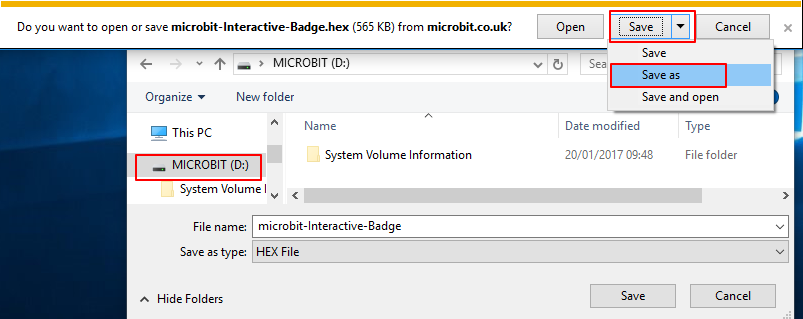

## Dangos delwedd

Gadewch i ni ddechrau trwy ddangos delwedd ar eich micro:bit pan fydd yn cael ei danio.

+ Ewch i <a href="http://jumpto.cc/pxt-new" target="_blank">jumpto.cc/pxt-new</a> i ddechrau prosiect newydd yn y golygydd MakeCode (PXT). Enwch eich prosiect newydd yn 'Bathodyn rhyngweithiol'.

+ Dylech nawr weld y golygydd cod. I dynnu llun ar eich micro:bit pan fydd yn cael ei danio, llusgwch floc `show leds` (dangos leds) o ardal y cod (ar y chwith) y tu mewn i'r bloc `start` (cychwyn).

+ I greu delwedd i'w harddangos, cliciwch ar y leds yr ydych am eu goleuo:

+ Bydd eich cod yn rhedeg yn awtomatig yn yr efelychwr ar y chwith:

+ Gallwch chi hefyd brofi'ch cod ar y micro:bit ei hun! I wneud hyn, cliciwch 'Download' (Lawrlwytho) ar y ddewislen ar ochr chwith y sgrin.

Bydd hyn yn creu a yn lawrlwytho ffeil `.hex` a fydd yn rhedeg ar eich micro:bit.

+ Defnyddiwch y cebl USB i blwgio eich micro:bit i mewn i'ch cyfrifiadur. Yna dylech weld bod eich micro:bit yn ymddangos yn rheolwr ffeiliau eich cyfrifiadur fel gyriant USB. 

+ Os ydych chi'n defnyddio'r uwchlwythwr micro:bit yna bydd y ffeil ` .hex` yn cael ei chopïo'n awtomatig i'r micro:bit. Gwiriwch gyda'ch gwirfoddolwr os nad ydych chi'n siŵr. 

Fel arall, bydd angen i chi gopïo'r ffeil `.hex` i'r micro:bit.

Os ydych chi'n defnyddio **Internet Explorer** gallwch ddewis `Save as` (Dewisiadau cadw) o'r ddewislen sy'n ymddangos ar waelod eich porwr ac yna dewiswch y gyriant micro:bit:

Os ydych chi'n defnyddio **Google Chrome** gallwch glicio ar y saeth ar ôl y ffeil wedi'i lawrlwytho a dewis 'Show in folder' (Dangos mewn ffolder) ac wedyn llusgo'r ffeil a amlygir i'r gyrrwr micro:bit:

+ Bydd golau ar gefn eich micro:bit yn fflachio tra bydd y ffeil yn cael ei chopïo. Unwaith y bydd hyn wedi stopio bydd eich rhaglen yn rhedeg. Gallwch glicio ar y botwm ailosod ar gefn eich micro:bit i ailgychwyn y rhaglen.

+ Dylech nawr weld eich delwedd ar y micro:bit. Os yw'n well gennych, gallwch chi gael gwared ar y cebl USB o'ch micro:bit, ac atodi'r batri. Bydd y rhaglen yn cael ei chadw ar y micro:bit.

Nid oes angen cyfrif arnoch i gadw eich pethau! Bydd eich prosiect yn cael ei gadw yn awtomatig yn y porwr, gallwch glicio ar `Projects` i weld eich prosiectau.

Gallwch hefyd glicio cadw i lawrlwytho'ch prosiect fel ffeil `.hex` sy'n cynnwys eich prosiect:

I lwytho'ch prosiect ar gyfrifiadur arall, cliciwch ar 'Projects' ac yna 'Import file' (Mewnforio ffeil) a dewiswch eich ffeil`.hex`.

