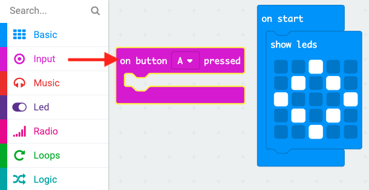
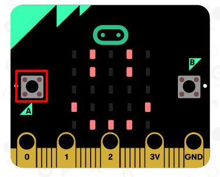

## Dangos wyneb hapus

Gadewch i ni ddangos wyneb hapus ar eich micro:bit pan fo'r botwm 'A' yn cael ei wasgu.

+ Hyd yn hyn, rydych chi wedi rhedeg cod pan fydd y micro:bit yn cael ei danio yn unig. Gallwch hefyd redeg cod pan fo botwm yn cael ei wasgu.

Llusgwch floc 'on button pressed' (pan wasgir botwm) o fewnbwn a gwnewch yn siŵr bod 'A' yn cael ei ddewis:

Bydd unrhyw god sydd wedi'i ychwanegu y tu mewn i'r bloc hwn yn rhedeg pan fo'r botwm 'A' ar eich micro:bit yn cael ei wasgu.

+ Llusgwch floc ` show leds ` arall y tu mewn i'ch digwyddiad newydd, a thynnu patrwm wyneb hapus.

+ Test out your new code in the emulator. Gwasgwch y botwm 'A' a dylech weld wyneb hapus ar eich micro:bit:

Gallwch hefyd brofi eich cod newydd ar eich micro:bit.