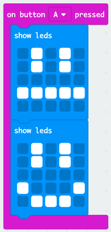

## Creu animeiddiad syml

Gadewch i ni greu animeiddiad syml (iawn) ar gyfer eich wynebau hapus a thrist.

+ Ychwanegwch ail `show leds` bloc i'ch `on button A pressed`, gydag wyneb niwtral.

+ Os ydych chi'n rhedeg y cod hwn i'w brofi, fe welwch fod y patrwm yn newid yn gyflym. Am oedi hirach, bydd angen i chi ychwanegu bloc `pause` (oedi) rhwng y ddwy ddelwedd sy'n cael eu harddangos.

I ddewis faint o filieiliadau i aros, cliciwch y saeth i lawr a rhowch rif. Mae 1000 milieiliad yn 1 eiliad, felly mae 250 milieiliad yn chwarter eiliad.

+ Bydd angen i chi animeiddio'ch wyneb trist hefyd. Y ffordd hawsaf o wneud hyn yw dyblygu'r blociau rydych chi newydd eu creu. De-gliciwch ar floc i'w ddyblygu. Sylwch fod y golygydd PXT yn dyblygu un bloc ar y tro yn unig (nid blociau lluosog fel Scratch.)

+ Yna gallwch chi lusgo'r blociau hyn i mewn i'ch bloc `on button B pressed` (pan wasgir botwm B). Dyma sut y dylai eich cod ymddangos:

+ Profwch eich cod, a dylech weld eich wynebau hapus a thrist animeiddiedig wrth i chi bwyso botwm A a B.

