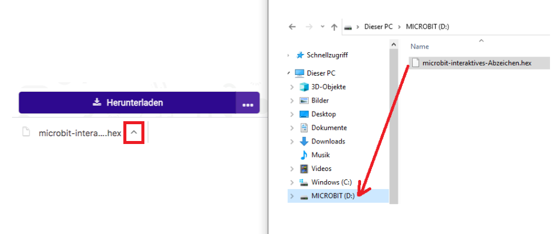

## Ein Bild anzeigen

Beginnen wir damit, ein Bild auf deinem micro:bit anzuzeigen, wenn es eingeschaltet ist.

+ Rufe <a href="https://rpf.io/microbit-new" target="_blank">rpf.io/microbit-new</a> auf, um ein neues Projekt im MakeCode (PXT) -Editor zu starten. Nenne dein neues Projekt "Interaktives Abzeichen".

+ Du solltest jetzt den Code-Editor sehen. Um ein Bild auf dein eingeschaltenes micro:bit zu zeichnen, ziehe einen `zeige LEDs` Block aus dem Codebereich (links) innerhalb des `Start-` Blocks.

+ Um ein anzuzeigendes Bild zu erstellen, klicke auf die LEDs, die beleuchtet werden sollen:

+ Dein Code wird automatisch links im Emulator ausgeführt:

+ Du kannst deinen Code auch auf dem micro:bit testen! Klicke dazu im Menü links auf dem Bildschirm auf "Herunterladen".

Dadurch wird eine `.hex` Datei erstellt und heruntergeladen, die auf deinem micro:bit ausgeführt wird.

+ Verwende das USB-Kabel, um dein micro:bit an deinen Computer anzuschließen. Du solltest dann sehen, dass dein micro:bit im Dateimanager deines Computers als USB-Laufwerk angezeigt wird. 

+ Wenn du micro:bit Hochladen verwendest, wird die `.hex` Datei automatisch in das micro:bit kopiert. Frag deinen Betreuer, wenn du dir nicht sicher bist. 

Andernfalls musst du die `.hex` Datei in das micro:bit kopieren.

Wenn du **Internet Explorer** nutzt, kannst du im Menü unten in deinem Browser `Speichern unter` auswählen und dann das Laufwerk micro:bit auswählen:

Wenn du **Google Chrome** nutzt, kannst du auf den Pfeil nach der heruntergeladenen Datei klicken und "In Ordner anzeigen" auswählen und ziehe dann die markierte Datei auf das micro:bit-Laufwerk:

+ Während des Kopierens der Datei blinkt ein Licht auf der Rückseite deines micro:bit. Sobald das aufgehört hat, wird dein Programm starten. Du kannst auf den Reset-Knopf auf der Rückseite deines micro:bit klicken, um das Programm neu zu starten.

+ Du solltest jetzt dein Bild auf dem micro:bit sehen. Wenn du möchtest, kannst du das USB-Kabel von deinem micro:bit entfernen und den Akku anschließen. Das Programm wird auf dem micro:bit gespeichert.

Du benötigst kein Konto, um deine Daten zu speichern! Dein Projekt wird automatisch im Browser gespeichert. Du kannst auf `Projekte` klicken, um deine Projekte anzuzeigen.

Du kannst auch auf Speichern klicken, um dein Projekt als `.hex` Datei herunterzuladen, welche dein Projekt enthält:

Um dein Projekt auf einen anderen Computer zu laden, klicke auf "Projekte" und dann auf "Datei importieren" und wähle deine `.hex` Datei aus.

