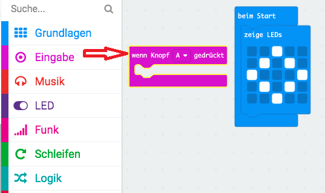
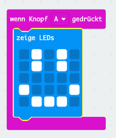

## Ein glückliches Gesicht anzeigen

Lass uns ein fröhliches Gesicht auf deinem mikro:bit zeigen, wenn der Knopf 'A' gedrückt ist.

+ Bisher hast du den Code nur ausgeführt, wenn das micro:bit eingeschaltet ist. Du kannst den Code auch ausführen, wenn ein Knopf gedrückt ist.

Zieh den Block "wenn Knopf gedrückt ist" von der Eingabe und stelle sicher, dass "A" ausgewählt ist:

Jeder in diesem Block hinzugefügte Code wird ausgeführt, wenn der Knopf "A" auf deinem micro:bit gedrückt wird.

+ Ziehe einen weiteren Block `zeige LEDs` in dein neues Ereignis und zeichne ein fröhliches Gesichtsmuster.

+ Teste deinen neuen Code im Emulator. Drücke die Taste "A" und du solltest ein fröhliches Gesicht auf deinem micro:bit sehen:

Du kannst deinen neuen Code auch auf deinem micro:bit testen.