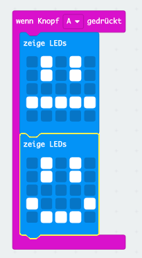
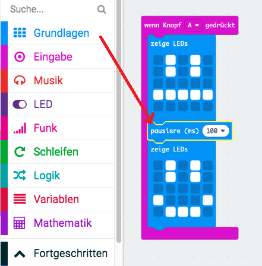
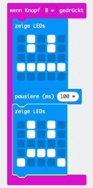

## Eine einfache Animation erstellen

Lass uns eine (sehr) einfache Animation für deine glücklichen und traurigen Gesichter erstellen.

+ Füge einen zweiten `zeige LEDs` Block mit einem neutralen Gesicht zu deinem Block `wenn Knopf A gedrückt` hinzu.

+ Wenn du diesen Code zum Testen ausführst, wirst du feststellen, dass sich das Muster schnell ändert. Für eine längere Verzögerung musst du zwischen den beiden angezeigten Bildern einen `Pause` Block einfügen.

Um festzulegen, wie viele Millisekunden gewartet werden soll, klicke auf den Abwärtspfeil und gib eine Zahl ein. 1000 Millisekunden sind 1 Sekunde, also sind 250 Millisekunden eine Viertelsekunde.

+ Du wirst auch dein trauriges Gesicht animieren müssen. Der einfachste Weg um dies zu tun, besteht darin, die soeben erstellten Blöcke zu duplizieren. Klicke mit der rechten Maustaste auf einen Block, um ihn zu duplizieren. Beachte dabei, dass der PXT-Editor jeweils nur einen Block dupliziert (nicht mehrere Blöcke wie Scratch)

+ Du kannst diese Blöcke dann in deinen Block `wenn Knopf B gedrückt` ziehen. So sollte dein Code aussehen:

+ Teste deinen Code und du solltest deine animierten glücklichen und traurigen Gesichter sehen, wenn du die Knöpfe A und B drückst.

