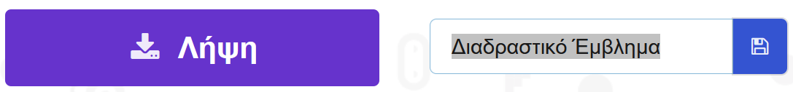
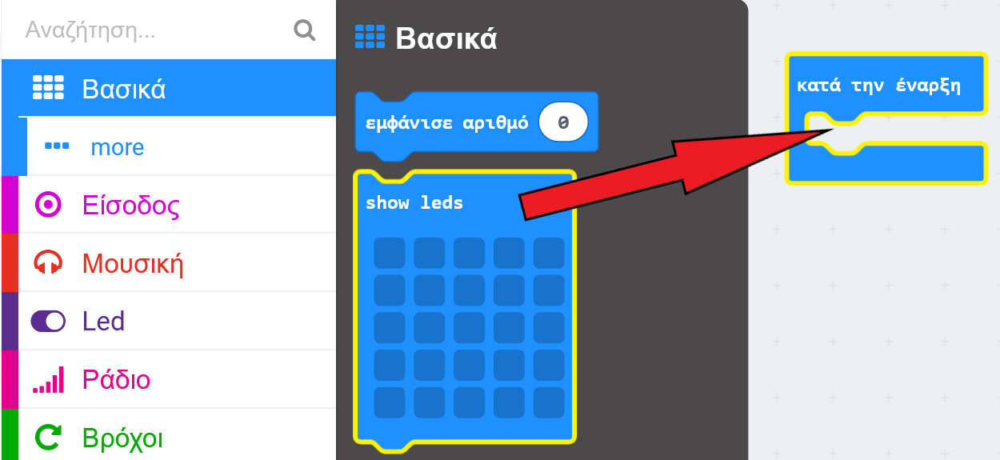
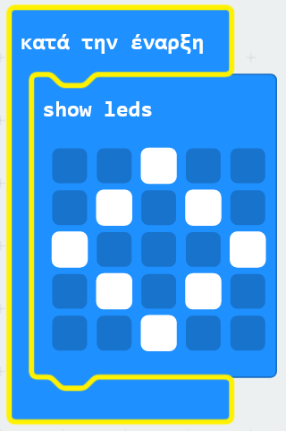
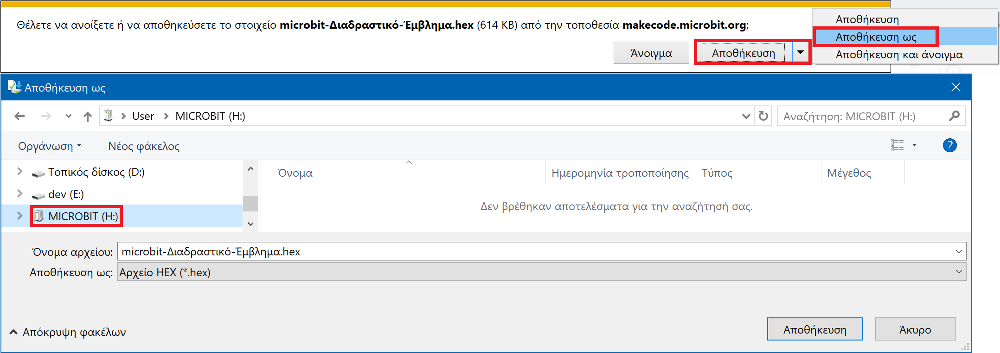
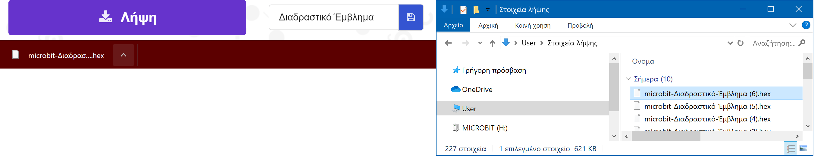
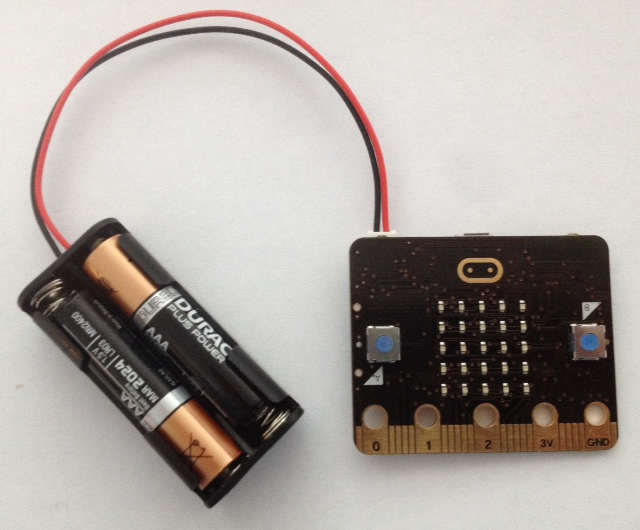
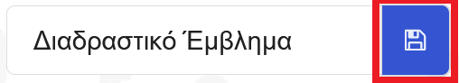
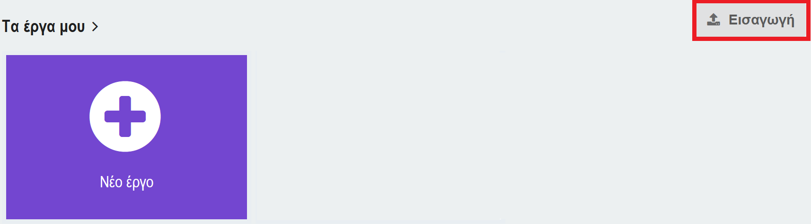

## Εμφάνιση μιας εικόνας

Ας ξεκινήσουμε εμφανίζοντας μια εικόνα στο micro:bit, όταν αυτό είναι ενεργοποιημένο.

+ Πήγαινε στο <a href="https://rpf.io/microbit-new" target="_blank">rpf.io/microbit-new</a> για να ξεκινήσεις ένα νέο έργο στο περιβάλλον προγραμματισμού MakeCode (PXT). Ονόμασε το νέο σου έργο ως "Διαδραστικό έμβλημα".

+ Τώρα θα πρέπει να βλέπεις το περιβάλλον προγραμματισμού. Για να σχεδιάσεις μια εικόνα στο micro:bit όταν αυτό είναι ενεργοποιημένο, σύρε ένα `show leds` μπλοκ από το τμήμα του κώδικα (στα αριστερά) μέσα στο `κατά την έναρξη` μπλοκ.

+ Για να δημιουργήσεις μια εικόνα για προβολή, κάνε κλικ στα Led (leds) που θέλεις να ανάψουν:

+ Ο κώδικάς σου θα εκτελεστεί αυτόματα στον προσομοιωτή στα αριστερά:

+ Μπορείς επίσης να δοκιμάσεις τον κώδικά σου στο ίδιο το micro:bit! Για να το κάνεις αυτό, κάνε κλικ στη 'Λήψη' στο μενού στα αριστερά της οθόνης.

Αυτό θα δημιουργήσει και θα κατεβάσει ένα `.hex` αρχείο που θα τρέχει στο micro:bit σου.

+ Χρησιμοποίησε το καλώδιο USB για να συνδέσεις το micro:bit στον υπολογιστή σου. Θα πρέπει τότε να δεις το micro:bit να εμφανίζεται στον διαχειριστή αρχείων του υπολογιστή σου ως μονάδα USB. 

+ Αν χρησιμοποιείς τον micro:bit μεταφορτωτή τότε το `.hex` αρχείο θα αντιγραφεί αυτόματα στο micro:bit. Επαλήθευσε με τον εθελοντή σου για σιγουριά. 

Διαφορετικά, θα χρειαστεί να αντιγράψεις το `.hex` αρχείο στο micro:bit.

Εάν χρησιμοποιείς **Internet Explorer** μπορείς να επιλέξεις `Αποθήκευση ως` από το μενού που εμφανίζεται στο κάτω μέρος του προγράμματος περιήγησης και, στη συνέχεια, επέλεξε την μονάδα micro:bit:

Εάν χρησιμοποιείς **Google Chrome** μπορείς να κάνεις κλικ στο βέλος δίπλα από το ληφθέν αρχείο, επέλεξε 'Εμφάνιση στον φάκελο' και στην συνέχεια σύρε το επιλεγμένο αρχείο στην μονάδα micro:bit:

+ Μια λυχνία στο πίσω μέρος του micro:bit θα αναβοσβήνει κατά την αντιγραφή του αρχείου. Μόλις αυτή ολοκληρωθεί, το πρόγραμμά σου θα εκτελεστεί. Μπορείς να κάνεις κλικ στο κουμπί reset στο πίσω μέρος του micro:bit για να επανεκκινήσεις το πρόγραμμα.

+ Θα πρέπει τώρα να βλέπεις την εικόνα σου στο micro:bit. Αν προτιμάς, μπορείς να αφαιρέσεις το καλώδιο USB από το micro:bit σου και να συνδέσεις την μπαταρία. Το πρόγραμμα θα αποθηκευτεί στο micro:bit.

Δεν χρειάζεσαι λογαριασμό για να αποθηκεύσεις τα έργα σου! Το έργο σου αυτόματα θα αποθηκευτεί στο πρόγραμμα περιήγησης, μπορείς να κάνεις κλικ στο `My Projects` για να δεις τα έργα σου.

Μπορείς επίσης να κάνεις κλικ στο κουμπί 'Λήψη' για να κάνεις λήψη του έργου σου ως ένα `.hex` αρχείο που θα περιέχει το έργο σου:

Για να φορτώσεις το έργο σου σε άλλον υπολογιστή, κάνε κλικ στο 'Τα έργα μου' και στη συνέχεια στο 'Εισαγωγή' και επέλεξε το `.hex` αρχείο.

