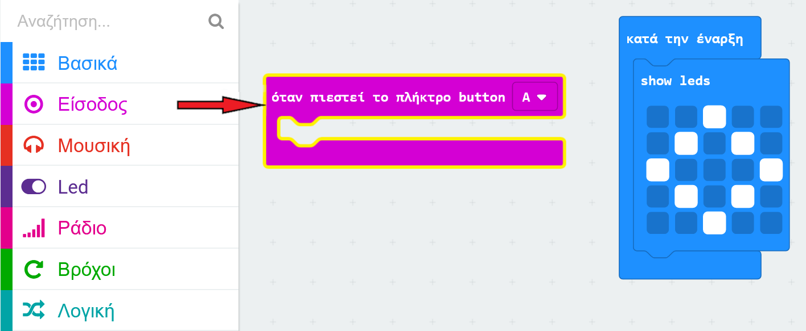
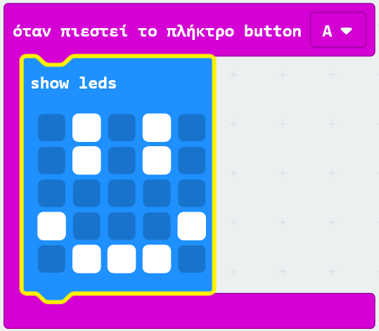

## Εμφάνιση χαμογελαστού προσώπου

Ας δείξουμε ένα χαμογελαστό πρόσωπο στο micro:bit,όταν πατηθεί το κουμπί 'A'.

+ Μέχρι στιγμής, έχεις εκτελέσει κώδικα μόνο όταν το micro:bit είναι ενεργοποιημένο. Μπορείς επίσης να εκτελέσεις κώδικα όταν ένα κουμπί πιέζεται.

Σύρε ένα "όταν πιεστεί το πλήκτρο" μπλοκ από το μενού "Είσοδος" και βεβαιώσου πως έχεις επιλέξει το "Α":

Οποιοσδήποτε κώδικας προστίθεται μέσα σε αυτό το μπλοκ θα εκτελεστεί όταν πατηθεί το κουμπί "A" στο micro:bit.

+ Σύρε ένα άλλο `show leds` μπλοκ μέσα σε αυτό το νέο σου γεγονός και σχεδίασε ένα χαμογελαστό πρόσωπο.

+ Δοκίμασε το νέο σου κώδικα στον προσομοιωτή. Πάτησε το κουμπί "Α" και θα δεις ένα χαμογελαστό πρόσωπο στο micro:bit:

Μπορείς επίσης να δοκιμάσεις το νέο σου κώδικα στο micro:bit σου.