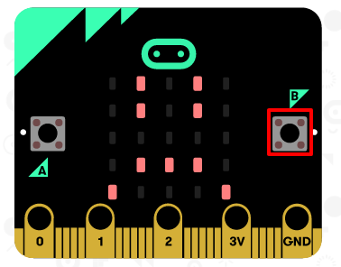

\--- challenge \---

## Πρόκληση: Εμφάνιση ενός λυπημένου προσώπου

Μπορείς να κάνεις την οθόνη του micro:bit σου να εμφανίζει ένα λυπημένο πρόσωπο,όταν το κουμπί 'Β' πατιέται; Για να το κάνεις αυτό θα χρειαστεί να χρησιμοποιήσεις ένα άλλο "όταν πιεστεί το πλήκτρο" μπλοκ και να επιλέξεις "Β".

\--- /challenge \---