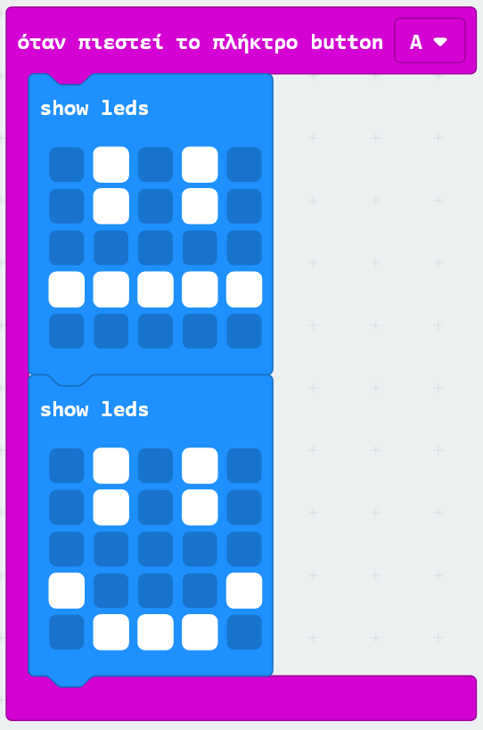
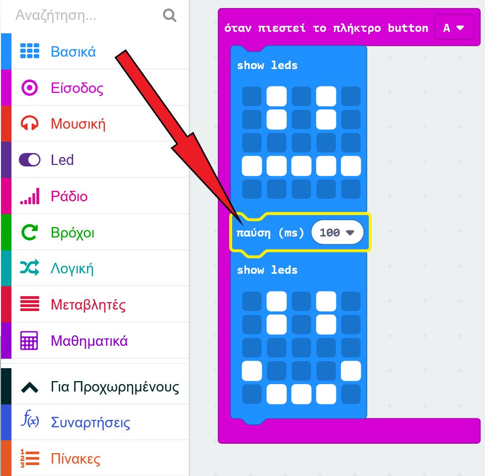
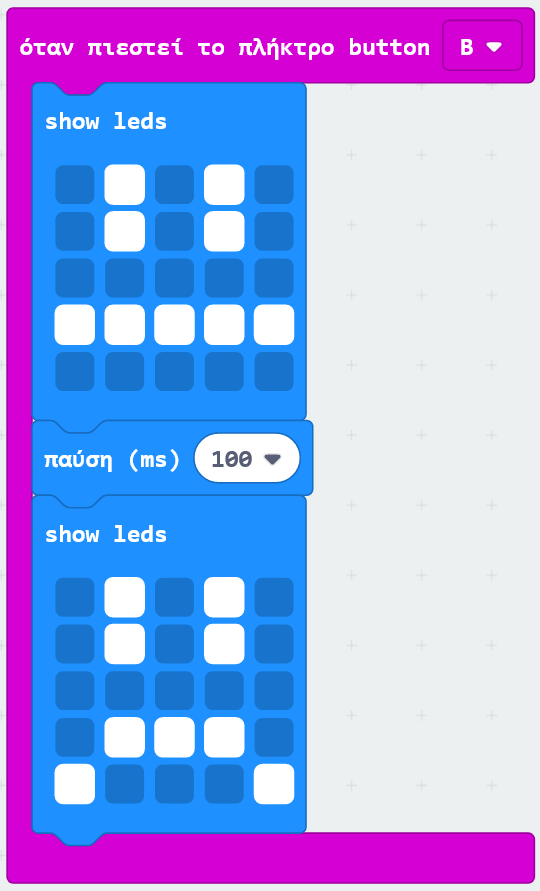

## Δημιουργία απλής κινούμενης εικόνας

Ας δημιουργήσουμε ένα (πολύ) απλό κινούμενο σχέδιο για τα χαμογελαστά και λυπημένα πρόσωπά σου.

+ Πρόσθεσε ένα δεύτερο `show leds` μπλοκ στο `όταν πιεστεί το πλήκτρο` μπλοκ, με ουδέτερο πρόσωπο.

+ Εάν εκτελέσεις αυτόν τον κώδικα για να τον δοκιμάσεις, θα προσέξεις πως το μοτίβο αλλάζει γρήγορα. Για μεγαλύτερη καθυστέρηση, θα χρειαστεί να προσθέσετε ένα μπλοκ `παύση` μεταξύ των δύο εμφανιζόμενων εικόνων.

Για να επιλέξεις πόσα χιλιοστά του δευτερολέπτου (πρέπει) να έχει καθυστέρηση, κάνε κλικ στο κάτω βέλος και εισήγαγε έναν αριθμό. 1000 χιλιοστά του δευτερολέπτου είναι 1 δευτερόλεπτο, οπότε τα 250 χιλιοστά του δευτερολέπτου είναι ένα τέταρτο του δευτερολέπτου.

+ Θα χρειαστεί επίσης να δώσεις ζωή στο λυπημένο σου πρόσωπο. Ο ευκολότερος τρόπος για να γίνει αυτό είναι να αντιγράψεις τα μπλοκ που μόλις δημιούργησες. Κάνε δεξί κλικ σε ένα μπλοκ για να το αντιγράψεις. Πρόσεξε πως το PXT περιβάλλον προγραμματισμού απλά αντιγράφει ένα μπλοκ κάθε φορά (όχι πολλαπλά μπλοκ όπως στο Scratch).

+ Στη συνέχεια, μπορείς να σύρεις αυτά τα μπλοκ στο `όταν πιεστεί το πλήκτρο` μπλοκ. Έτσι πρέπει να φαίνεται ο κώδικάς σου:

+ Δοκίμασε τον κώδικά σου και θα πρέπει να βλέπεις τα κινούμενά σου χαμογελαστά και λυπημένα πρόσωπα όποτε πατάς τα κουμπιά Α και Β.

