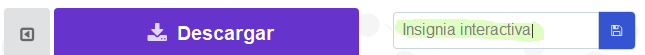
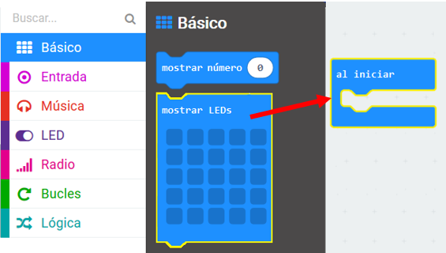
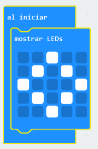
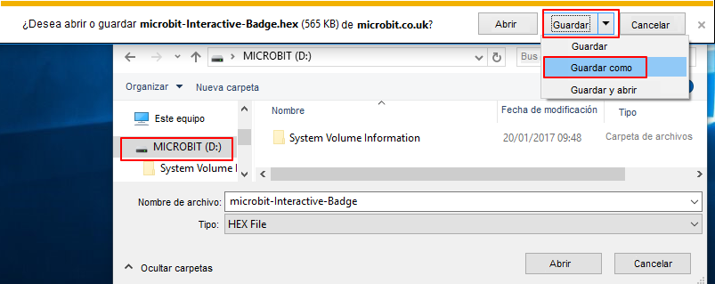
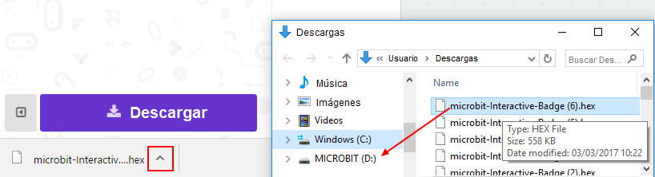
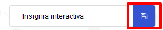
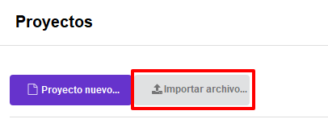

## Mostrando una imagen

Empecemos por mostrar una imagen en tu micro:bit cuando esté encendido.

+ Ve a <a href="https://rpf.io/microbit-new" target="_blank">rpf.io/microbit-new</a> para comenzar un nuevo proyecto en el editor MakeCode (PXT). Nombra tu nuevo proyecto 'Insignia Interactiva'.

+ Ahora deberías ver el editor de código. Para dibujar una imagen en tu micro:bit cuando está encendido, arrastra un bloque `mostrar LEDs` del área de código (a la izquierda) dentro del bloque `al iniciar`.

+ Para crear una imagen para mostrar, haz clic en los leds que deseas iluminar:

+ Tu código se ejecutará automáticamente en el emulador de la izquierda:

+ ¡También puedes probar tu código en el propio micro:bit! Para hacer esto, haz clic en 'Descargar' en el menú de la izquierda de la pantalla.

Esto creará y descargará un archivo `.hex` que se ejecutará en tu micro:bit.

+ Usa el cable USB para conectar tu micro:bit a tu computadora. Deberías ver tu micro: bit aparecer en el administrador de archivos de tu computadora como una unidad USB. 

+ Si estás usando el cargador micro:bit entonces el archivo `.hex` se copiará automáticamente en el micro:bit. Consulta con tu voluntario si no estás seguro. 

De lo contrario, tendrás que copiar el archivo `.hex` al micro:bit.

Si estás usando **Internet Explorer** puedes elegir `Guardar como` del menú que aparece en la parte inferior de tu navegador y seleccionar la unidad micro:bit:

Si estás usando **Google Chrome** puedes hacer clic en la flecha después de descargado el archivo y elige 'Mostrar en carpeta' y luego arrastrar el archivo resaltado a la unidad micro:bit:

+ Una luz en la parte trasera de tu micro:bit parpadeará mientras se copia el archivo. Una vez se haya detenido, tu programa se ejecutará. Puedes hacer clic en el botón de reinicio en la parte trasera de tu micro:bit para reiniciar el programa.

+ Ahora deberías ver tu imagen en el micro:bit. Si lo prefieres, puedes quitar el cable USB de tu micro:bit y conectar la batería. El programa se guardará en el micro:bit.

¡No necesitas una cuenta para guardar tus cosas! Tu proyecto se guardará automáticamente en el navegador, puedes hacer clic en `Proyectos` para ver tus proyectos.

También puedes hacer clic en guardar para descargar tu proyecto como un archivo `.hex` que contiene tu proyecto:

Para cargar tu proyecto en otra computadora, haz clic en 'Proyectos' y luego en 'Importar archivo' y selecciona tu archivo `.hex`.

