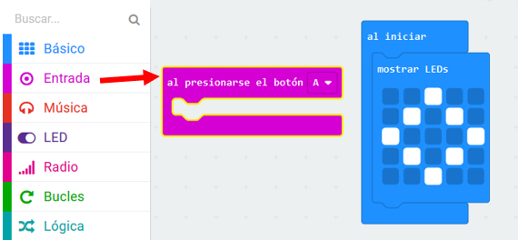
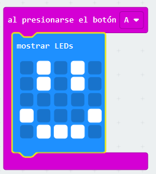

## Mostrando una cara feliz

Mostremos una cara feliz en tu micro:bit cuando se presiona el botón 'A'.

+ Hasta ahora, solo has ejecutado código cuando el micro:bit está encendido. También puedes ejecutar código cuando se presiona un botón.

Arrastra un bloque 'al presionar el botón' desde la entrada y asegúrate que 'A' esté seleccionado:

Cualquier código agregado dentro de este bloque se ejecutará cuando se presione el botón 'A' de tu micro:bit.

+ Arrastra otro bloque de `mostrar LEDs` dentro de tu nuevo evento y dibuja el patrón de una cara feliz.

+ Prueba tu nuevo código en el emulador. Presiona el botón 'A' y deberás ver una cara feliz en tu micro:bit:

También puedes probar tu nuevo código en tu micro:bit.