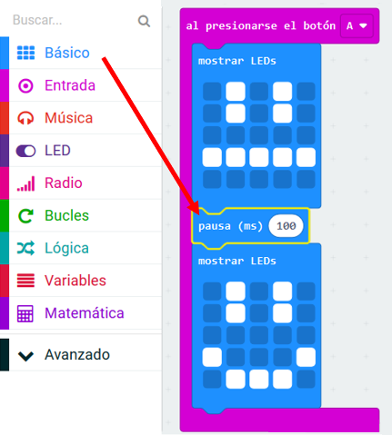
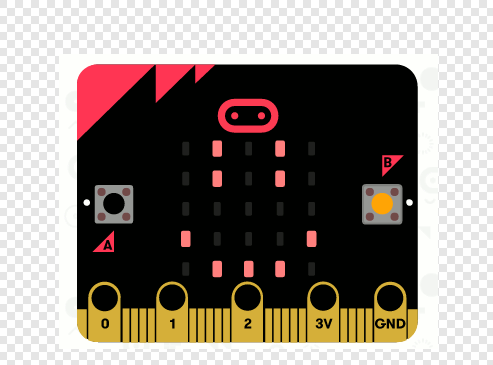

## Creando una animación simple

Creemos una animación (muy) simple para tu cara feliz y triste.

+ Agrega un segundo bloque `mostrar LEDs` a tu bloque `al presionar el botón A`, con una cara neutral.

+ Si ejecutas este código para probarlo, notarás que el patrón cambia rápidamente. Para un retraso más largo, tendrás que agregar un bloque `pausa` entre las dos imágenes que se muestran.

Para elegir cuántos milisegundos esperar, haz clic en la flecha hacia abajo y escribe un número. 1000 milisegundos es 1 segundo, así que 250 milisegundos es un cuarto de segundo.

+ También tendrás que animar tu cara triste. La forma más fácil de hacer esto es duplicar los bloques que acabas de crear. Haz clic derecho en un bloque para duplicarlo. Ten en cuenta que el editor PXT sólo duplica un bloque a la vez (no múltiples bloques como Scratch.)

+ Luego puedes arrastrar estos bloques a tu bloque `al presionar el botón B`. Así es como debería verse tu código:

+ Prueba tu código, y deberías ver tus caras felices y tristes animadas cuando presionas el botón A y B.

