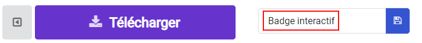
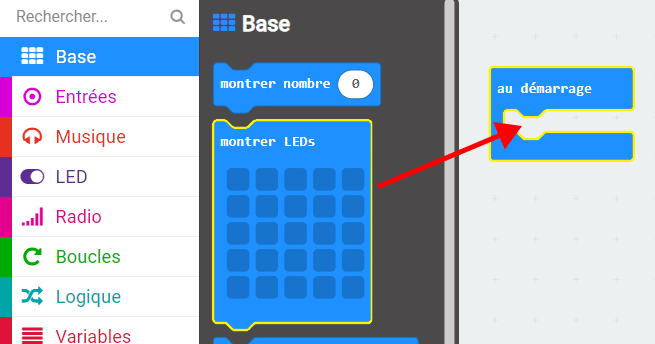
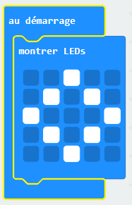
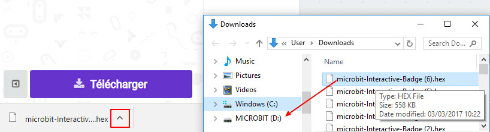
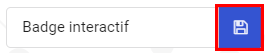
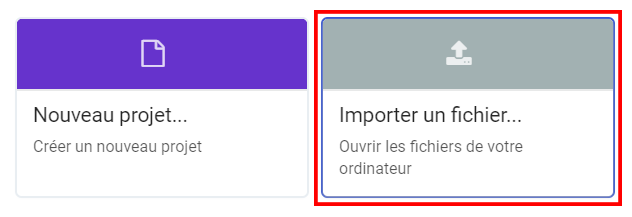

## Afficher une image

Commençons par afficher une image sur ton micro:bit quand il est allumé.

+ Va sur <a href="https://rpf.io/microbit-new" target="_blank">rpf.io/microbit-new</a> pour démarrer un nouveau projet dans l'éditeur MakeCode (PXT). Appelle ton nouveau projet « Badge interactif ».

+ Tu devrais maintenant voir l'éditeur de code. Pour dessiner une image sur ton micro:bit quand il démarre, place un bloc `montrer Leds` dans la zone de code (sur la gauche) à l'intérieur du bloc `au démarrage`.

+ Pour créer une image à afficher, clique sur les leds que tu veux allumer :

+ Ton code s’exécutera automatiquement dans l'émulateur sur la gauche :

+ Tu peux aussi tester ton code sur le micro:bit lui-même ! Pour cela, clique sur « Télécharger » dans le menu à gauche de l'écran.

Cela va créer et télécharger un fichier `.hex` que tu pourras exécuter sur ton micro:bit.

+ Utilise un câble USB pour brancher ton micro:bit sur ton ordinateur. Tu devrais voir apparaître ton micro:bit dans le gestionnaire de fichiers, sous la forme d'une clé USB. 

+ Si tu utilises le micro:bit uploader alors le fichier `.hex` sera automatiquement copié sur le micro:bit. Demande à un bénévole si tu n'es pas sûr. 

Sinon tu devras copier le fichier `.hex` sur le micro:bit.

Si tu utilises **Internet Explorer** tu peux sélectionner `Enregistrer sous` dans le menu qui apparaît au bas de ton navigateur, puis sélectionner le disque micro:bit :

Si tu utilises **Google Chrome** tu peux cliquer sur la flèche à côté du fichier et choisir « Afficher dans le dossier », puis déplacer le fichier sélectionné sur le disque micro:bit :

+ Un voyant à l'arrière de ton micro: bit clignotera pendant la copie du fichier. Une fois que c'est terminé, ton programme s'exécutera. Tu peux cliquer sur le bouton reset à l'arrière de ton micro:bit pour redémarrer le programme.

+ Tu devrais maintenant voir ton image sur le micro:bit. Si tu préfères, tu peux enlever le câble USB de ton micro:bit, et le brancher sur la batterie. Le programme sera sauvegardé sur le micro:bit.

Tu n'as pas besoin d'un compte pour enregistrer ton programme ! Ton projet sera automatiquement enregistré dans ton navigateur, tu peux cliquer sur `Projets` pour voir tes projets.

Tu peux aussi cliquer sur Enregistrer pour télécharger ton projet sous la forme d'un fichier `.hex` qui contient ton projet :

Pour charger ton projet sur un autre ordinateur, clique sur « Projets », puis sur « Importer un fichier » et sélectionne ton fichier `.hex`.

