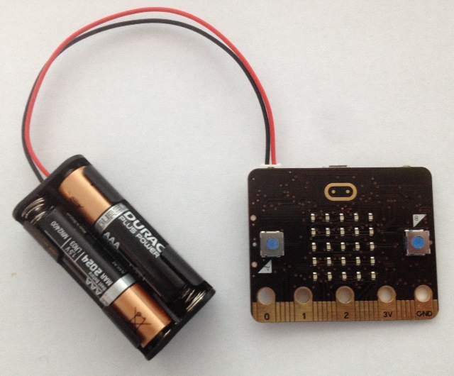

## Displaying an image

Commençons par afficher une image sur la micro:bit quand elle démarre.

+ Va sur <a href="http://jumpto.cc/pxt-new" target="_blank">jumpto.cc/pxt-new</a> pour démarrer un nouveau projet dans l'éditeur PXT. Appelle ton nouveau projet 'Badge interactif'.

+ Tu dois maintenant voir l'éditeur de code. Pour dessiner une image sur ton micro:bit quand elle démarre, place un bloc `montrer LEDs` dans la zone de code (sur la gauche) à l'intérieur du bloc `au démarrage`.

+ Pour créer une image à afficher, clique sur les LEDs que tu veux allumer&nbsp;:

+ Ton code s’exécutera automatiquement dans l'émulateur sur la gauche.&nbsp;:

+ Tu peux aussi tester ton code sur la micro:bit elle même&nbsp;! Pour cela, clique sur 'Télécharger' dans le menu à gauche de l'écran.

Cela va créer et télécharger un fichier `.hex` que tu pourras exécuter sur ton micro:bit.

+ Utilise un cable USB pour brancher ton micro:bit sur ton ordinateur. Tu devrais voir apparaître ton micro:bit dans le gestionnaire de fichiers, sous la forme d'une clé USB.

+ Si tu utiliser l'uploader micro:bit alors le fichier `.hex` sera automatiquement copié sur la micro:bit. Demande à un bénévole si tu n'es pas sûr.

Sinon tu devras copier le fichier `.hex` sur la micro:bit.

Si tu utilises __Internet Explorer__ tu peux sélectionner `Enregistrer sous` dans le menu qui apparaît au bas de ton navigateur, puis sélectionner le disque micro:bit&nbsp;:

Si tu utilises  __Google Chrome__ tu peux cliquer sur la flèche à côté du fichier et choisir 'Afficher dans le dossier', puis déplacer le fichier sélectionné sur le disque micro:bit&nbsp;:

+ Une lumière à l'arrière de ton micro:bit va clignoter pendant quelques instants, le tant que le fichier soit copié. Une fois que c'est terminé, ton programme va démarrer. Tu peux cliquer sur le bouton reset à l'arrière de ton micro:bit pour redémarrer le programme.

+ Tu devrais maintenant voir ton image sur la micro:bit.
  Si tu préfères, tu peux enlever le cable USB de ton micro:bit, et la brancher sur des piles.
  Le programme enregistré sur la micro:bit va démarrer.

Tu n'as pas besoin d'un compte pour enregistrer ton programme&nbsp;!
Ton projet sera automatiquement enregistré dans ton navigateur, tu peux cliquer sur `Projets` pour voir tes projets.

Tu peux aussi cliquer sur Enregistrer pour télécharger ton projet sous la forme d'un fichier `.hex` qui contient ton programme&nbsp;:

Pour charger ton projet sur un autre ordinateur, clique sur 'Projets', puis sur 'Importer un fichier' et sélectionne ton fichier `.hex`.

