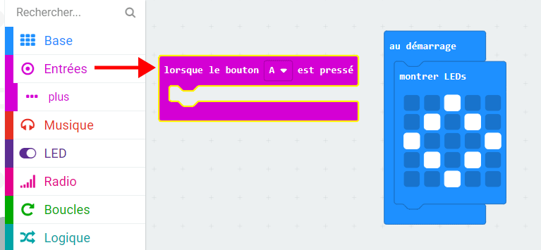
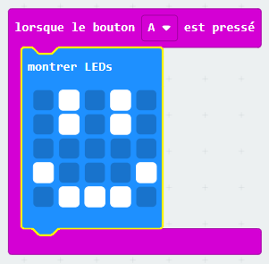

## Afficher un visage heureux

Affichons un visage heureux sur ton micro:bit lorsque le bouton « A » est pressé.

+ Jusqu'à présent, tu n'as exécuté le code que lorsque le micro: bit est allumé. Tu peux aussi exécuter du code lorsqu'un bouton est pressé.

Fais glisser un bloc « lorsque le bouton est pressé » depuis Entrées et assures-toi que « A » est sélectionné :

Tout le code ajouté à l'intérieur de ce bloc ne s'exécutera que lorsque le bouton « A » de ton micro:bit sera pressé.

+ Fais glisser un autre bloc `montrer LEDs` à l'intérieur de ton nouvel événement et dessine un motif de visage heureux.

+ Teste ton nouveau code dans l'émulateur. Appuie sur le bouton « A » et tu devrais voir un visage heureux sur ton micro:bit :

Tu peux également tester ton nouveau code sur ton micro:bit.