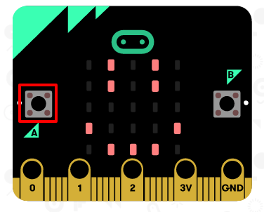

## Affiche un sourire

Montrons maintenant un sourire sur ta micro:bit quand le bouton 'A' est pressé.

+ Jusqu'ici, tu as seulement exécuté du code au démarrage de la the micro:bit. Tu peux aussi exécuter du code quand un bouton est pressé.

Place un bloc `Lorsque le bouton est pressé` et vérifie que le bouton A est sélectionné&nbsp;

Tout le code ajouté à l'intérieur de ce bloc ne s'exécutera que lorsque le bouton 'A' de ta micro:bit sera pressé.

+ Place un bloc `montrer LEDs` à l'intérieur de ton nouvel événement, pour dessiner un visage souriant.

+ Teste ton code dans l'émulateur. Clique sur le bouton 'A' et tu devrais voir apparaître un visage souriant sur ta micro:bit&nbsp;:

Tu peux aussi tester ton code sur ta micro:bit.
