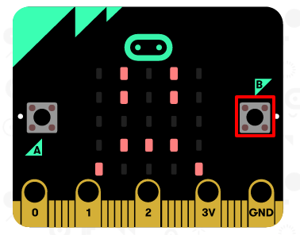

\--- challenge \---

## Défi : Afficher un visage triste

Est-ce que tu peux faire en sorte que ton micro:bit affiche un visage triste quand le bouton « B » est pressé ? Tu devras utiliser un autre bloc « lorsque le bouton est pressé » et sélectionner « B ».

\--- /challenge \---