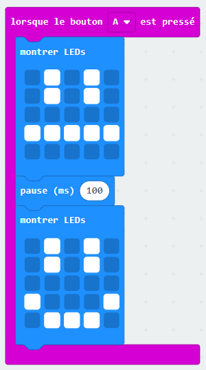
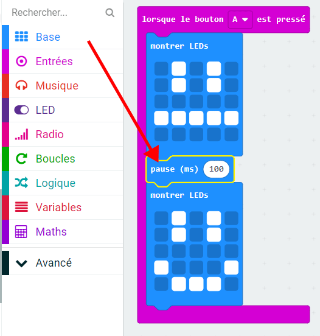
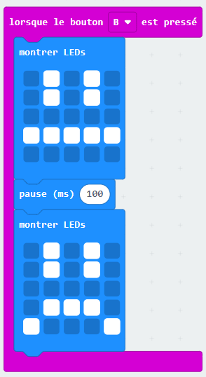

## Crée une animation simple

Créons une animation (très) simple pour tes visages souriants et tristes.

+ Ajoute un second bloc `montrer LEDs` dans ton bloc `lorsque le bouton A est pressé`, avec un visage neutre.

+ Si tu teste ce code, tu verras que le dessin change rapidement. Pour que le changement soit plus lent, tu devras ajouter un bloc  `pause` entre les 2 images affichées.

Pour choisir combien de millisecondes attendre, clique sur la flèche vers le bas et saisit un nombre. 1000 millisecondes c'est 1 seconde, donc 250 millisecondes c'est un quart de seconde.

+ Tu devras aussi animer ton visage triste. La façon la plus simple d'y arriver est de dupliquer les blocs que tu viens juste de créer. Tu remarqueras que l'éditeur PXT duplique seulement un seul bloc à la fois (et pas plusieurs blocs comme dans Scratch).

+ Tu peux ensuite déplacer ces blocs dans ton bloc `lorsque le bouton B est pressé`. Voilà à quoi devrait ressembler ton code&nbsp;:

+ Teste ton code, et tu devrais voir un visage souriant ou triste animé quand tu appuies sur le bouton A ou B.

