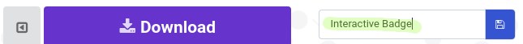
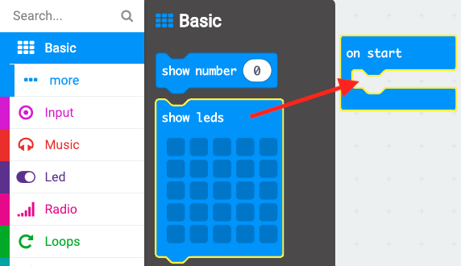

## एक छवि प्रदर्शित करना

आइए आपके micro:bit के चालू होने पर एक छवि दिखाकर शुरू करें।

+ Go to <a href="https://rpf.io/microbit-new" target="_blank">rpf.io/microbit-new</a> to start a new project in the MakeCode (PXT) editor. अपने नए प्रोजेक्ट को 'Interactive badge' (इंटरएक्टिव बैज) नाम दें।

+ अब आपको कोड संपादक देखना चाहिए। अपने micro:bit के चालू होने पर कोई छवि बनाने के लिए, कोड क्षेत्र (बाईं ओर) से `show leds` (एलईडी दिखाएँ) ब्लॉक को `start` (आरंभ) ब्लॉक के अंदर खींचें।

+ प्रदर्शित करने के लिए कोई छवि बनाने के लिए, उन एलईडी पर क्लिक करें जिन्हें आप जलाना चाहते हैं:

+ आपका कोड बाईं ओर एमुलेटर में स्वचालित रूप से चलेगा:

+ आप micro:bit पर ही अपने कोड का परीक्षण भी कर सकते हैं! ऐसा करने के लिए, स्क्रीन के बाईं ओर मेनू पर 'Download' ('डाउनलोड करें') पर क्लिक करें।

इससे एक `.hex` फ़ाइल तैयार और डाउनलोड होगी जो आपके micro:bit पर चलेगी।

+ अपने micro:bit को अपने कंप्यूटर में प्लग करने के लिए USB (यूएसबी) केबल का प्रयोग करें। तब आपको अपना micro:bit आपके कंप्यूटर के फ़ाइल मैनेजर में यूएसबी ड्राइव के रूप में दिखना चाहिए। 

+ यदि आप अपलोडर का उपयोग कर रहे हैं तो `.hex` फाइल स्वचालित रूप से micro:bit पर कॉपी हो जाएगी। यदि आप सुनिश्चित नहीं हैं तो अपने वालंटियर से पता करें। 

अन्यथा आपको `.hex` फ़ाइल को micro:bit में कॉपी करना होगा।

यदि आप **Internet Explorer** (इंटरनेट एक्सप्लोरर) का उपयोग कर रहे हैं तो आपके ब्राउज़र के नीचे दिखाई देने वाले मेनू से `Save as` (इस रूप में सहेजें) चुन सकते हैं और फिर micro:bit ड्राइव का चयन कर सकते हैं:

यदि आप **Google Chrome** (गूगल क्रोम) का उपयोग कर रहे हैं तो आप डाउनलोड की गई फ़ाइल के बाद दिखाई देने वाले तीर पर क्लिक कर सकते हैं और 'Show in folder' ('फ़ोल्डर में दिखाएँ') को चुनकर हाइलाइट की गई फ़ाइल को खींचकर micro:bit ड्राइव में ले जा सकते हैं:

+ जब फ़ाइल कॉपी हो रही होगी तो आपके micro:bit के पीछे की ओर एक रोशनी फ्लैश होगी। इसके बंद हो जाने के बाद आपका प्रोग्राम चल पड़ेगा। प्रोग्राम को दुबारा शुरू करने के लिए आप अपने micro:bit के पीछे रीसेट बटन पर क्लिक कर सकते हैं।

+ अब आपको micro:bit पर आपकी छवि दिखनी चाहिए। यदि आप चाहें, तो आप अपने micro:bit से यूएसबी केबल को हटा सकते हैं, और बैटरी अटैच कर सकते हैं। प्रोग्राम micro:bit पर सहेजा जाएगा।

आपको अपनी सामग्री सहेजने के लिए खाते की आवश्यकता नहीं है! आपके प्रोजेक्ट को स्वचालित रूप से ब्राउज़र में सहेजा जाएगा, आप अपने प्रोजेक्ट्स को देखने के लिए `Projects` (प्रोजेक्ट्स) पर क्लिक कर सकते हैं।

आप अपनी प्रोजेक्ट वाली फ़ाइल को `.hex` फ़ाइल के रूप में डाउनलोड करने के लिए सहेजें पर भी क्लिक सकते हैं:

अपने प्रोजेक्ट को किसी अन्य कंप्यूटर पर लोड करने के लिए, 'Projects' ('प्रोजेक्ट') पर क्लिक करें और फिर 'Import file' ('फ़ाइल आयात करें') पर क्लिक करें और अपनी `.hex` फ़ाइल चुनें।

