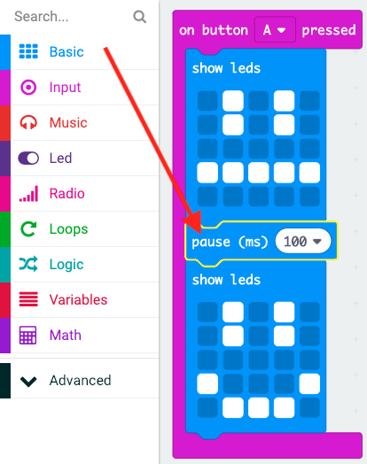

## एक साधारण एनिमेशन बनाना

आइए आपके खुश और उदास चेहरों के लिए एक (बहुत) सरल एनिमेशन बनाएँ।

+ अपने `on button A pressed` (बटन A दबाए जाने पर) ब्लॉक में तटस्थ चेहरे के साथ एक दूसरा `show leds` (एलईडी दिखाएँ) ब्लॉक जोड़ें।

+ यदि आप इस कोड को इसका परीक्षण करने के लिए चलाते हैं, तो आप देखेंगे कि पैटर्न बहुत जल्दी बदलता है। लंबी देरी के लिए, आपको प्रदर्शित होने वाली दो छवियों के बीच `pause` (विराम) ब्लॉक जोड़ना होगा।

यह चुनने के लिए कि कितने मिलीसेकंड प्रतीक्षा की जाए, नीचे के तीर पर क्लिक करें और कोई संख्या दर्ज करें। 1000 मिलीसेकंड 1 सेकंड होता है, इसलिए 250 मिलीसेकंड एक सेकंड का चौथाई है।

+ आपको अपने दुखी चेहरे को भी एनिमेट करने की आवश्यकता होगी। ऐसा करने का सबसे आसान तरीका यह है कि आपने अभी-अभी जो ब्लॉक बनाए हैं उनके डुप्लीकेट बना लिए जाएँ। इसका डुप्लीकेट बनाने के लिए ब्लॉक पर राइट-क्लिक करें। ध्यान दें कि PXT editor (PXT संपादक) एक समय में केवल एक ब्लॉक का डुप्लीकेट बनाता है (स्क्रैच जैसे एकाधिक ब्लॉक का नहीं।)

+ फिर आप इन ब्लॉकों को अपने `on button B pressed` (बटन B दबाए जाने पर) ब्लॉक में खींच कर ले जा सकते हैं। यहाँ दिखाया गया है कि आपका कोड कैसा दिखना चाहिए:

+ अपने कोड का परीक्षण करें, और जब आप बटन A और B दबाते हैं तो आपको अपने एनिमेट किए हुए खुश और उदास चेहरे दिखाई देने चाहिए।

