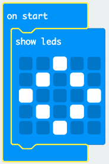
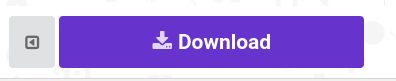
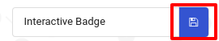

## Prikazivanje slike

Započnimo prikazivanjem slike na vašem mikro: bitu kada je uključen.

+ Idite na <a href="https://rpf.io/microbit-new" target="_blank">rpf.io/microbit-new</a> da biste pokrenuli novi projekt u MakeCode (PXT) uređivaču. Nazovite svoj novi projekt 'Interaktivna značka'.

+ Sada biste trebali vidjeti uređivač koda. Da biste nacrtali sliku na mikro: bit kad je uključen, povucite `show vodi` blok iz područja koda (slijeva) unutar bloka `start`.

+ Da biste stvorili sliku za prikaz, kliknite na diode koje želite osvijetliti:

+ Vaš se kôd automatski pokreće u emulatoru slijeva:

+ Kôd možete testirati i na samom micro: bit-u! Da biste to učinili, kliknite "Preuzmi" na izborniku s lijeve strane zaslona.

To će stvoriti i preuzeti `.hex` datoteku koja će se izvoditi na vašem micro: bitu.

+ Pomoću USB kabela priključite mikro: bit u vaše računalo. Tada biste trebali vidjeti svoj mikro: bit će se u upravitelju datoteka vašeg računala pojaviti kao USB pogon. 

+ Ako ste pomoću mikro: bitni za učitavanje onda `.hex` datoteka će biti automatski kopirati u mikro: bitni. Provjerite sa svojim volonterom ako niste sigurni. 

U suprotnom ćete morati kopirati `.hex` datoteku u mikro: bit.

Ako koristite **Internet Explorer** iz izbornika koji se prikazuje na dnu preglednika odaberite `Spremi kao` a zatim odaberite mikro: bitni pogon:

Ako koristite **Google Chrome** , možete kliknuti strelicu nakon preuzete datoteke i odabrati "Prikaži u mapi", a zatim povucite označenu datoteku na mikro: bitni pogon:

+ Na stražnjoj strani mikroba bit će bljeskati dok se datoteka kopira. Kad se to zaustavi, vaš će se program pokrenuti. Možete kliknuti gumb za resetiranje na stražnjoj strani mikro: bit za ponovno pokretanje programa.

+ Sada biste trebali vidjeti svoju sliku na mikro: bitu. Ako želite, možete ukloniti USB kabel iz mikro: bit-a i pričvrstiti bateriju. Program će biti spremljen na micro: bit.

Ne treba vam račun za spremanje stvari! Vaš će se projekt automatski spremiti u preglednik, možete kliknuti na `Projekti` da biste vidjeli svoje projekte.

Također možete kliknuti spasiti preuzeti svoj projekt kao `.hex` datoteka koja sadrži vaš projekt:

Da biste učitali svoj projekt na drugo računalo, kliknite 'Projekti', a zatim 'Uvezi datoteku' i odaberite svoju datoteku `.xx`.

