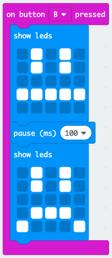

## Stvaranje jednostavne animacije

Stvorimo (vrlo) jednostavnu animaciju za vaša sretna i tužna lica.

+ Dodajte drugi `prikazi,` blok vašem gumbu `on, pritisnut` bloka, s neutralnim licem.

+ Ako pokrenete ovaj kod da biste ga testirali, primijetit ćete da se uzorak brzo mijenja. Za dulje odgađanje morat ćete dodati blok od `pauze` između dviju prikazanih slika.

Da biste odabrali koliko milisekundi čeka, kliknite strelicu prema dolje i unesite broj. 1000 milisekundi je 1 sekunda, dakle 250 milisekundi je četvrtina sekunde.

+ Također ćete trebati animirati svoje tužno lice. Najlakši način za to je umnožavanje blokova koje ste upravo stvorili. Desnom tipkom miša kliknite blok da biste ga duplicirali. Imajte na umu da PXT editor samo duplicira jedan blok istovremeno (a ne više blokova poput Scratch.)

+ Zatim možete povući ove blokove u gumb `na gumbu B, a zatim pritisnuti` blok. Ovako treba izgledati vaš kod:

+ Testirajte svoj kôd i trebali biste vidjeti svoja animirana sretna i tužna lica kada pritisnete tipke A i B.

