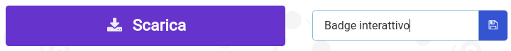
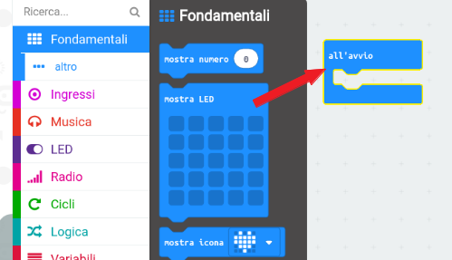
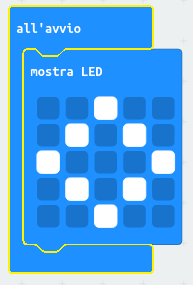
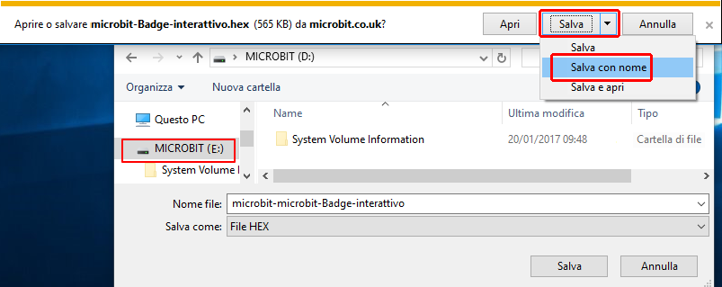
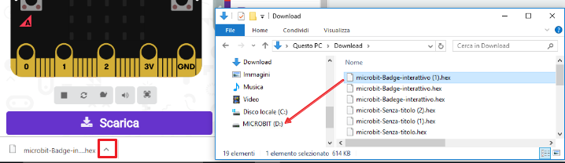
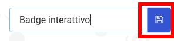
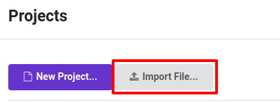

## Mostrare un’immagine

Cominciamo mostrando un'immagine sul tuo micro: bit quando viene acceso.

+ Vai all'indirizzo <a href="https://rpf.io/microbit-new" target="_blank">rpf.io/microbit-new</a> per iniziare un nuovo progetto con l'editor MakeCode (PXT). Chiama il tuo nuovo progetto "Badge interattivo".

+ Ora dovresti vedere l'editor del codice. Per disegnare un'immagine sul tuo micro:bit quando viene acceso, trascina un blocco `mostra Led` dall'area del codice (a sinistra) all'interno del blocco `all'avvio`.

+ Per creare un'immagine da visualizzare, fai clic sui led che si desidera accendere:

+ Il tuo codice verrà eseguito automaticamente nell'emulatore a sinistra:

+ Puoi anche testare il tuo codice sul micro:bit! Per fare ciò, fai clic su "Download" nel menu in basso a sinistra dello schermo.

Questo creerà e scaricherà un file `.hex` che verrà eseguito sul tuo micro:bit.

+ Usa il cavo USB per collegare il micro:bit al tuo computer. Dovresti vedere il tuo micro:bit apparire nel file manager del tuo computer come se fosse un'unità USB. 

+ Se stai utilizzando l'uploader di micro:bit, il file `.hex` verrà automaticamente copiato nel micro:bit. Controlla con il tuo volontario se non sei sicuro. 

Altrimenti dovrai copiare il file `.hex` nel micro:bit.

Se sta utilizzando **Internet Explorer** puoi scegliere `Salva con nome` dal menu visualizzato nella parte inferiore del browser, e quindi selezionare l'unità micro:bit:

Se stai utilizzando **Google Chrome** puoi fare clic sulla freccia vicino al file scaricato e scegliere "Mostra nella cartella", quindi trascinare il file evidenziato sull'unità micro:bit:

+ Una luce sul retro del micro: bit lampeggerà durante la copia del file. Una volta terminato, il programma verrà eseguito. Puoi cliccare il pulsante reset sul retro del tuo micro:bit per riavviare il programma.

+ Ora dovresti vedere la tua immagine sul micro:bit. Se preferisci, puoi rimuovere il cavo USB dal tuo micro:bit e collegare la batteria. Il programma è stato salvato sul micro:bit.

Non hai bisogno di un account per salvare le tue cose! Il tuo progetto verrà automaticamente salvato nel browser, puoi fare clic su `Progetti` per vedere i tuoi progetti.

Puoi anche fare clic su Salva per scaricare il progetto come file `.hex`, conterrà il tuo progetto:

Per caricare il progetto su un altro computer, fare clic su "Progetti", quindi su "Importa file" e seleziona il tuo file `.hex`.

