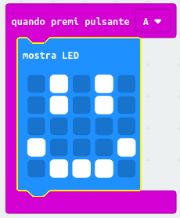

## Mostrare una faccia felice

Mostriamo una faccia felice sul tuo micro: bit quando viene premuto il pulsante 'A'.

+ Finora, hai eseguito il codice solo quando il micro: bit viene acceso. È possibile eseguire il codice anche premendo un pulsante.

Trascina un blocco "quando premi pulsante" dagli ingressi e assicurati che sia selezionato "A":

Qualsiasi codice aggiunto all'interno di questo blocco verrà eseguito quando viene premuto il pulsante "A" sul micro: bit.

+ Trascina un altro blocco `mostra led` all'interno del tuo nuovo evento e disegna uno smile.

+ Prova il tuo nuovo codice nell'emulatore. Premendo il pulsante 'A', dovresti vedere uno smile sul tuo micro: bit:

Puoi anche testare il tuo nuovo codice sul micro: bit.