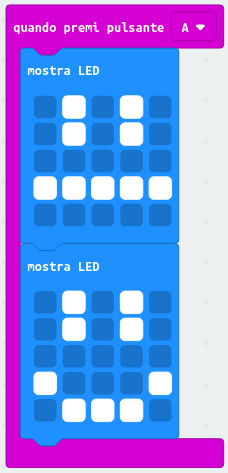
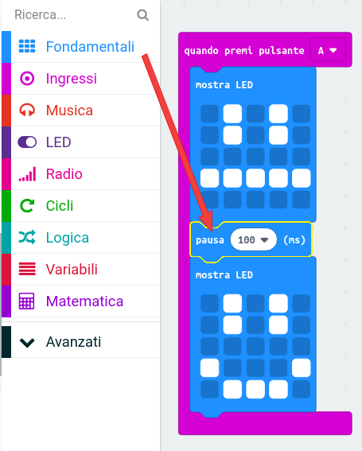
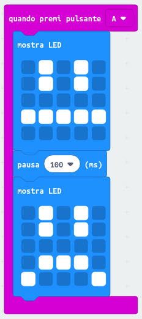

## Creare una semplice animazione

Creiamo un'animazione (molto) semplice per i tuoi volti, felice e triste.

+ Aggiungi un secondo blocco `mostra led` nel blocco `quando premi pulsante A`, disegnando una faccia neutra.

+ Se esegui questo codice per testarlo, noterai che il disegno cambia rapidamente. Per un ritardo più lungo, dovrai aggiungere un blocco `pausa` tra le due immagini visualizzate.

Per scegliere quanti millisecondi attendere, fai clic sulla freccia rivolta verso il basso e inserisci un numero. 1000 millisecondi equivalgono a 1 secondo, quindi 250 millisecondi è un quarto di secondo.

+ Dovrai anche animare la faccia triste. Il modo più semplice per farlo è duplicare i blocchi che hai appena creato. Clicca con il tasto destro su un blocco per duplicarlo. Fai attenzione che l'editor PXT duplica solo un blocco alla volta (non più blocchi contemporaneamente come in Scratch.)

+ Ora è possibile trascinare questi blocchi nel blocco `quando premi pulsante B`. Ecco cosa dovresti aver realizzato:

+ Testando il tuo codice, dovresti vedere i volti animati, felice e triste. quando vengono premuti i pulsanti A e B.

