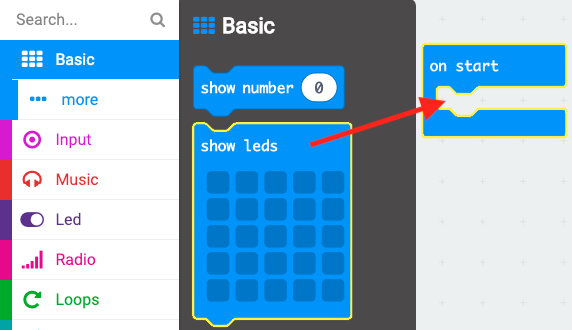
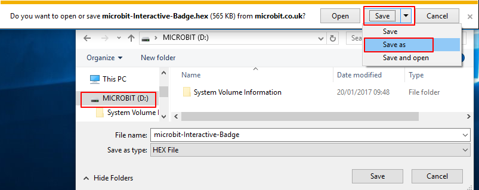
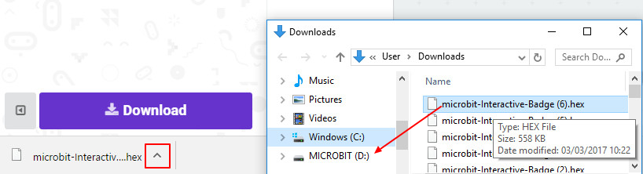

## ಚಿತ್ರವನ್ನು ಪ್ರದರ್ಶಿಸಲಾಗುತ್ತಿದೆ

ನಿಮ್ಮ micro:bit ಅದು ಚಾಲನೆಯಲ್ಲಿರುವಾಗ ಚಿತ್ರವನ್ನು ತೋರಿಸುವ ಮೂಲಕ ಪ್ರಾರಂಭಿಸೋಣ.

+ <a href="https://rpf.io/microbit-new" target="_blank">rpf.io/microbit-new</a> ಗೆ ಹೋಗಿ MakeCode (PXT) ಸಂಪಾದಕದಲ್ಲಿ ಹೊಸ ಯೋಜನೆಯನ್ನು ಪ್ರಾರಂಭಿಸಿ. ನಿಮ್ಮ ಹೊಸ ಪ್ರಾಜೆಕ್ಟ್ ಅನ್ನು 'ಸಂವಾದಾತ್ಮಕ ಬ್ಯಾಡ್ಜ್' ಎಂದು ಕರೆಯಿರಿ.

+ ನೀವು ಈಗ ಕೋಡ್ ಸಂಪಾದಕವನ್ನು ನೋಡಬೇಕು. ನಿಮ್ಮ micro:bit ‌ನಲ್ಲಿ ಅದು ಚಾಲನೆಯಲ್ಲಿರುವಾಗ ಚಿತ್ರವನ್ನು ರಚಿಸಲು, `show leds` ಪ್ರಾರಂಭದ ಒಳಗೆ ಕೋಡ್ ಪ್ರದೇಶದಿಂದ (ಎಡಭಾಗದಲ್ಲಿ) ನಿರ್ಬಂಧಿಸಿ `start` ಬ್ಲಾಕ್.

+ ಪ್ರದರ್ಶಿಸಲು ಚಿತ್ರವನ್ನು ರಚಿಸಲು, ನೀವು ಬೆಳಗಿಸಲು ಬಯಸುವ ಲೆಡ್‌ಗಳ ಮೇಲೆ ಕ್ಲಿಕ್ ಮಾಡಿ:

+ ನಿಮ್ಮ ಕೋಡ್ ಎಡಭಾಗದಲ್ಲಿರುವ ಎಮ್ಯುಲೇಟರ್‌ನಲ್ಲಿ ಸ್ವಯಂಚಾಲಿತವಾಗಿ ಚಲಿಸುತ್ತದೆ:

+ ನಿಮ್ಮ ಕೋಡ್ ಅನ್ನು ನೀವು micro:bit ನಲ್ಲಿ ಸಹ ಪರೀಕ್ಷಿಸಬಹುದು! ಇದನ್ನು ಮಾಡಲು, ಪರದೆಯ ಎಡಭಾಗದಲ್ಲಿರುವ ಮೆನುವಿನಲ್ಲಿ 'ಡೌನ್‌ಲೋಡ್' (Download) ಕ್ಲಿಕ್ ಮಾಡಿ.

ಇದು ನಿಮ್ಮ micro:bit ನಲ್ಲಿ ಕಾರ್ಯನಿರ್ವಹಿಸುವ `.hex` ಫೈಲ್ ಅನ್ನು ರಚಿಸಿ ಡೌನ್‌ಲೋಡ್ ಮಾಡುತ್ತದೆ.

+ ನಿಮ್ಮ micro:bit ಅನ್ನು ನಿಮ್ಮ ಕಂಪ್ಯೂಟರ್‌ಗೆ ಪ್ಲಗ್ ಮಾಡಲು USB ಕೇಬಲ್ ಬಳಸಿ. ನಿಮ್ಮ ಕಂಪ್ಯೂಟರ್‌ನ ಫೈಲ್ ಮ್ಯಾನೇಜರ್‌ನಲ್ಲಿ USB ಡ್ರೈವ್ ಆಗಿ ನಿಮ್ಮ micro:bit ಕಾಣಿಸಿಕೊಳ್ಳುವುದನ್ನು ನೀವು ನೋಡಬಹುದು. 

+ ನೀವು micro:bit ಅಪ್‌ಲೋಡರ್ ಬಳಸುತ್ತಿದ್ದರೆ `.hex` ಫೈಲ್ ಅನ್ನು ಸ್ವಯಂಚಾಲಿತವಾಗಿ ಮೈಕ್ರೋ: ಬಿಟ್‌ಗೆ ಕಳುಹಿಸಲಾಗುತ್ತದೆ. ನಿಮಗೆ ಖಚಿತವಿಲ್ಲದಿದ್ದರೆ ನಿಮ್ಮ ಸ್ವಯಂಸೇವಕರೊಂದಿಗೆ ಸ್ವಯಂಸೇವಕರಲ್ಲಿ ಕೇಳಿ. 

ಇಲ್ಲದಿದ್ದರೆ ನೀವು `.hex` ಫೈಲನ್ನು micro:bit ಗೆ ಕಳುಹಿಸಬೇಕಾಗುತ್ತದೆ.

ನೀವು **Internet Explorer** ಬಳಸುತ್ತಿದ್ದರೆ ನಿಮ್ಮ ಬ್ರೌಸರ್‌ನ ಕೆಳಭಾಗದಲ್ಲಿ ಗೋಚರಿಸುವ `Save as` ಮೆನುವಿನಿಂದ micro:bit ಡ್ರೈವ್ ಅನ್ನು ಆರಿಸಿ, ಇದನ್ನು ಸೇವ್ ಮಾಡಬಹುದು:

ನೀವು **Google Chrome** ಬಳಸುತ್ತಿದ್ದರೆ ಡೌನ್‌ಲೋಡ್ ಮಾಡಿದ ಫೈಲ್‌ನ ಪಕ್ಕದಲ್ಲಿರುವ ಬಾಣದ ಮೇಲೆ ಕ್ಲಿಕ್ ಮಾಡಿ ಮತ್ತು 'Show in folder' ಆಯ್ಕೆಮಾಡಿ ನಂತರ ಹೈಲೈಟ್ ಮಾಡಿದ ಫೈಲ್ ಅನ್ನು micro:bit ಡ್ರೈವ್‌ಗೆ ಎಳೆಯಿರಿ:

+ ಫೈಲ್ ಅನ್ನು ಕಳುಹಿಸುವಾಗ ನಿಮ್ಮ micro:bit ನ ಹಿಂಭಾಗದಲ್ಲಿರುವ ಬೆಳಕು ಮಿಂಚುತ್ತದೆ. ಇದನ್ನು ನಿಲ್ಲಿಸಿದ ನಂತರ ನಿಮ್ಮ ಪ್ರೋಗ್ರಾಂ ಚಾಲನೆಯಾಗುತ್ತದೆ. ಪ್ರೋಗ್ರಾಂ ಅನ್ನು ಮರುಪ್ರಾರಂಭಿಸಲು ನಿಮ್ಮ micro:bit ನ ಹಿಂಭಾಗದಲ್ಲಿರುವ ಮರುಹೊಂದಿಸುವ ಗುಂಡಿಯನ್ನು ನೀವು ಕ್ಲಿಕ್ ಮಾಡಬಹುದು.

+ ನೀವು ಈಗ ನಿಮ್ಮ ಚಿತ್ರವನ್ನು micro:bitನಲ್ಲಿ ನೋಡಬೇಕು. ನೀವು ಬಯಸಿದರೆ, ನಿಮ್ಮ micro:bitನಿಂದ USB ಕೇಬಲ್ ಅನ್ನು ತೆಗೆದು ಬ್ಯಾಟರಿಯನ್ನು ಸೇರಿಸಬಹುದು. ಪ್ರೋಗ್ರಾಂ ಅನ್ನು micro:bitನಲ್ಲಿ ಉಳಿಸಲಾಗುತ್ತದೆ.

ನಿಮ್ಮ ಪ್ರಾಜೆಕ್ಟ್ ಅನ್ನು ಉಳಿಸಲು ನಿಮಗೆ ಖಾತೆ ಅಗತ್ಯವಿಲ್ಲ! ನಿಮ್ಮ ಪ್ರಾಜೆಕ್ಟ್ ಸ್ವಯಂಚಾಲಿತವಾಗಿ ಬ್ರೌಸರ್‌ನಲ್ಲಿ ಉಳಿಸಲ್ಪಡುತ್ತದೆ, ನಿಮ್ಮ ಯೋಜನೆಗಳನ್ನು ನೋಡಲು, ನೀವು `Projects` ಮೇಲೆ ಕ್ಲಿಕ್ ಮಾಡಬಹುದು.

ನಿಮ್ಮ ಪ್ರಾಜೆಕ್ಟ್ ಅನ್ನು ಒಳಗೊಂಡಿರುವ `.hex` ಫೈಲ್ ಆಗಿ ಡೌನ್‌ಲೋಡ್ ಮಾಡಲು ನೀವು ಸೇವ್ ಕ್ಲಿಕ್ ಮಾಡಬಹುದು:

ನಿಮ್ಮ ಪ್ರಾಜೆಕ್ಟ್ ಅನ್ನು ಮತ್ತೊಂದು ಕಂಪ್ಯೂಟರ್‌ನಲ್ಲಿ ಲೋಡ್ ಮಾಡಲು, 'Projects' ಕ್ಲಿಕ್ ಮಾಡಿ ಮತ್ತು 'Import file' ಕ್ಲಿಕ್ ಮಾಡಿ ಮತ್ತು ನಿಮ್ಮ `.hex` ಫೈಲ್ ಆಯ್ಕೆಮಾಡಿ.

