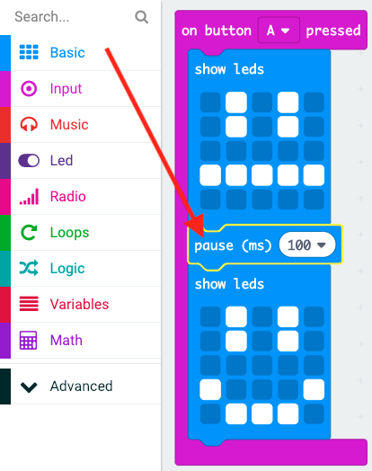

## ಸರಳ ಅನಿಮೇಷನ್ ರಚಿಸುವುದು

ನಿಮ್ಮ ಸಂತೋಷದ ಮತ್ತು ದುಃಖದ ಮುಖಗಳಿಗಾಗಿ (ಅತ್ಯಂತ) ಸರಳ ಅನಿಮೇಷನ್ ಅನ್ನು ರಚಿಸೋಣ.

+ ಎರಡನೇ `show leds` ಸೇರಿಸಿ ತಟಸ್ಥ ಮುಖದೊಂದಿಗೆ ನಿಮ್ಮ ` on button A pressed`ನಿರ್ಬಂಧಿಸಿ ಬಟನ್ ಅನ್ನು ಒತ್ತಿ.

+ ಇದನ್ನು ಪರೀಕ್ಷಿಸಲು ನೀವು ಈ ಕೋಡ್ ಅನ್ನು ಚಲಾಯಿಸಿದರೆ, ಮಾದರಿಯು ತ್ವರಿತವಾಗಿ ಬದಲಾಗುತ್ತದೆ ಎಂಬುದನ್ನು ನೀವು ಗಮನಿಸಬಹುದು. ದೀರ್ಘ ವಿಳಂಬಕ್ಕಾಗಿ, ನೀವು ` pause ` ಬ್ಲಾಕನ್ನು ಪ್ರದರ್ಶಿಸಲಾಗುವ ಎರಡು ಚಿತ್ರಗಳ ನಡುವೆ ಸೇರಿಸಬೇಕು.

ಎಷ್ಟು ಮಿಲಿಸೆಕೆಂಡುಗಳು ಕಾಯಬೇಕೆಂದು ಆಯ್ಕೆ ಮಾಡಲು, ಕೆಳಗಿನ -ಬಾಣ ಕ್ಲಿಕ್ ಮಾಡಿ ಮತ್ತು ಸಂಖ್ಯೆಯನ್ನು ನಮೂದಿಸಿ. 1000 ಮಿಲಿಸೆಕೆಂಡುಗಳು 1 ಸೆಕೆಂಡ್, ಆದ್ದರಿಂದ 250 ಮಿಲಿಸೆಕೆಂಡುಗಳು ಒಂದು ಸೆಕೆಂಡಿನ ಕಾಲು ಭಾಗ.

+ ನಿಮ್ಮ ದುಃಖದ ಮುಖವನ್ನು ನೀವು ಅನಿಮೇಟ್ ಮಾಡಬೇಕಾಗುತ್ತದೆ. ಇದನ್ನು ಮಾಡಲು ಸುಲಭವಾದ ಮಾರ್ಗವೆಂದರೆ ನೀವು ಇದೀಗ ರಚಿಸಿದ ಬ್ಲಾಕ್‌ಗಳನ್ನು ನಕಲು ಮಾಡುವುದು. ಅದನ್ನು ನಕಲು ಮಾಡಲು ಬ್ಲಾಕ್ ಮೇಲೆ ಬಲ ಕ್ಲಿಕ್ ಮಾಡಿ. ಪಿಎಕ್ಸ್‌ಟಿ ಸಂಪಾದಕವು ಒಂದು ಸಮಯದಲ್ಲಿ ಒಂದು ಬ್ಲಾಕ್ ಅನ್ನು ನಕಲು ಮಾಡುತ್ತದೆ ಎಂಬುದನ್ನು ಗಮನಿಸಿ (Scratch ನಂತೆ ಬಹು ಬ್ಲಾಕ್‌ಗಳಲ್ಲ.)

+ ಇದನ್ನು ಮಾಡಲು ಈ ಬ್ಲಾಕುಗಳನ್ನು ನಿಮ್ಮ `on button B pressed` ಬ್ಲಾಕಿನಲ್ಲಿ ಎಳಿಯಿರಿ. ನಿಮ್ಮ ಕೋಡ್ ಹೇಗೆ ಕಾಣಬೇಕು ಎಂಬುದು ಇಲ್ಲಿದೆ:

+ ನಿಮ್ಮ ಕೋಡ್ ಅನ್ನು ಪರೀಕ್ಷಿಸಿ, ನೀವು ಎ ಮತ್ತು ಬಿ ಗುಂಡಿಯನ್ನು ಒತ್ತಿದಾಗ ನಿಮ್ಮ ಅನಿಮೇಟೆಡ್ ಸಂತೋಷ ಮತ್ತು ದುಃಖದ ಮುಖಗಳನ್ನು ನೀವು ನೋಡಬೇಕು.

