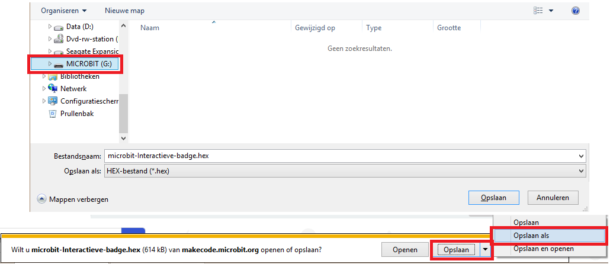

## Een afbeelding weergeven

Laten we beginnen met het weergeven van een afbeelding op je micro:bit wanneer deze is ingeschakeld.

+ Ga naar <a href="https://rpf.io/microbit-new" target="_blank">rpf.io/microbit-new</a> om een ​​nieuw project te starten in de MakeCode (PXT) editor. Noem je nieuwe project 'Interactieve badge'.

+ Je zou nu de code-editor moeten zien. Om een afbeelding op je micro:bit te tekenen wanneer deze is ingeschakeld, sleep je een `toon lichtjes` blok van het codegebied (aan de linkerkant) binnen het `bij opstarten` blok.

+ Om een afbeelding te maken om weer te geven, klik je op leds die je wilt laten oplichten:

+ Je code wordt automatisch uitgevoerd in de emulator aan de linkerkant:

+ Je kunt je code ook op de micro:bit zelf testen! Klik hiervoor op 'Downloaden' in het menu links op het scherm.

Hiermee wordt een `.hex` bestand gemaakt en gedownload dat op je micro:bit wordt uitgevoerd.

+ Gebruik de USB-kabel om je micro:bit aan te sluiten op je computer. Je zou dan je micro:bit in het bestandsbeheerder van je computer moeten zien verschijnen als een USB-schijf. 

+ Als je de micro:bit-uploader gebruikt, wordt het bestand `.hex` automatisch naar de micro:bit gekopieerd. Neem contact op met je vrijwilliger als je niet zeker bent. 

Anders moet je het bestand `.hex` naar de micro:bit kopiëren.

Als je **Internet Explorer** gebruikt, kun je `Opslaan als` in het menu kiezen dat onderaan je browser verschijnt en vervolgens de micro:bit drive selecteren:

Als je **Google Chrome** gebruikt kun je op de pijl klikken als het bestand is gedownload en 'Weergeven in map' kiezen alvorens het gemarkeerde bestand naar de micro:bit-schijf te slepen:

+ Een lampje op de achterkant van je micro:bit knippert terwijl het bestand wordt gekopieerd. Zodra dit is gestopt, wordt je programma uitgevoerd. Je kunt op de reset-knop aan de achterkant van je micro:bit klikken om het programma opnieuw te starten.

+ Je zou nu je afbeelding op de micro:bit moeten zien. Als je wilt, kun je de USB-kabel van je micro:bit verwijderen en de batterij aansluiten. Het programma wordt opgeslagen op de micro:bit.

Je hebt geen account nodig om je spullen op te slaan! Je project wordt automatisch opgeslagen in de browser, je kunt klikken op `Mijn projecten` om je projecten te bekijken.

Je kunt ook op opslaan klikken om je project te downloaden als een `.hex` bestand dat je project bevat:

Om je project op een andere computer te laden, klik je op 'Mijn projecten' en daarna 'Importeren' en selecteer je je `.hex`-bestand.

