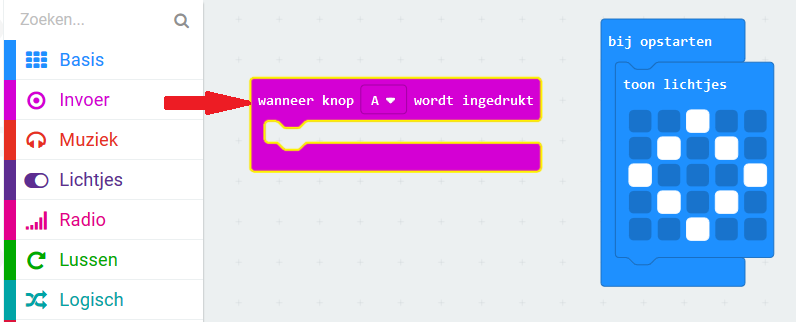
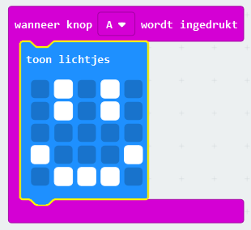

## Een blij gezicht tonen

Laten we een blij gezicht op je micro:bit laten zien wanneer de 'A'-knop wordt ingedrukt.

+ Tot nu toe heb je alleen code uitgevoerd wanneer de micro:bit is ingeschakeld. Je kunt ook code uitvoeren wanneer op een knop wordt gedrukt.

Sleep een blok 'on button pressed' uit input en zorg dat 'A' is geselecteerd:

Elke code die aan dit blok wordt toegevoegd, wordt uitgevoerd wanneer de 'A'-knop op je micro:bit wordt ingedrukt.

+ Sleep nog een `toon lichtjes` blok naar je nieuwe evenement en teken een blij gezichtspatroon.

+ Test out your new code in the emulator. Druk op de 'A'-knop en je zou een blij gezicht op je micro:bit moeten zien:

Je kunt je nieuwe code ook testen op je micro:bit.