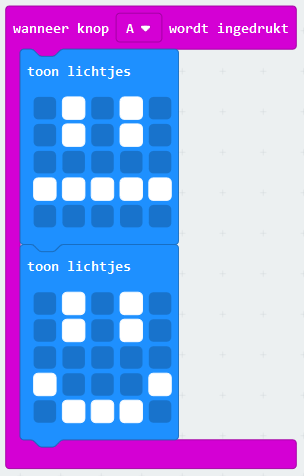
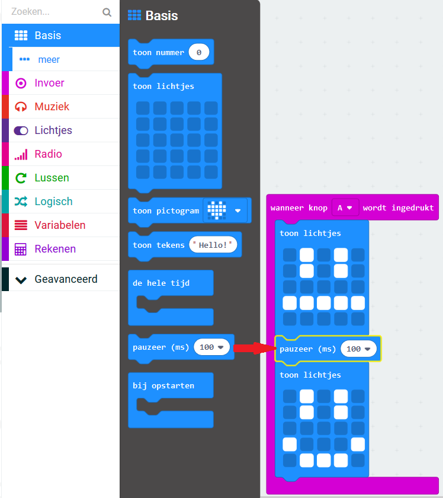
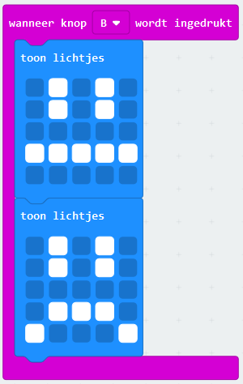

## Een eenvoudige animatie maken

Laten we een (heel) eenvoudige animatie maken voor je blije en droevige gezichten.

+ Voeg een tweede `toon lichtjes` blok toe aan je `wanneer knop A wordt ingedrukt` blok, met een neutraal gezicht.

+ Als je deze code uitvoert om het te testen, zul je merken dat het patroon snel verandert. Voor een langere vertraging moet je een blok `pauzeer` plaatsen tussen de twee afbeeldingen die worden weergegeven.

Om te kiezen hoeveel milliseconden wordt gewacht, klik je op de pijl omlaag en voer je een getal in. 1000 milliseconden is 1 seconde, dus 250 milliseconden is een kwart seconde.

+ Je zult ook je droevige gezicht moeten animeren. De eenvoudigste manier om dit te doen, is door de blokken die je zojuist hebt gemaakt te dupliceren. Klik met de rechtermuisknop op een blok om het te dupliceren. Je zult zien dat de PXT-editor slechts één blok tegelijk dupliceert (niet meerdere blokken zoals Scratch.)

+ Je kunt deze blokken vervolgens naar je `wanneer knop B wordt gedrukt` blok slepen. Dit is hoe je code eruit zou moeten zien:

+ Test je code en je zou je geanimeerde blije en droevige gezichten moeten zien wanneer je op knop A en B drukt.

