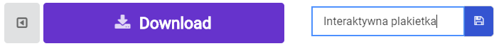
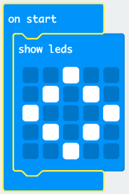
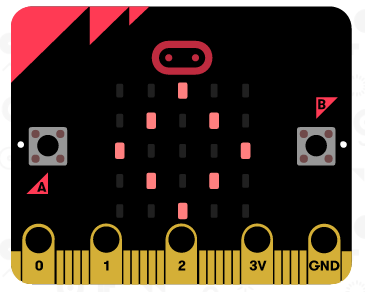

## Wyświetlanie obrazka

Zacznijmy od wyświetlenia obrazu na twoim micro:bit, gdy się go włącza.

+ Przejdź do <a href="https://rpf.io/microbit-new" target="_blank">rpf.io/microbit-new</a> aby rozpocząć nowy projekt w edytorze MakeCode (PXT). Nazwij swój nowy projekt „Interaktywna plakietka”.

+ Możesz teraz zobaczyć edytor kodu. Aby narysować obraz na micro:bit po włączeniu, przeciągnij blok `show leds` z obszaru kodu (po lewej) do środka bloku `start`.

+ Aby utworzyć obraz do wyświetlenia, kliknij diody LED, które chcesz zapalić:

+ Twój kod będzie działał automatycznie w emulatorze po lewej:

+ Możesz również przetestować kod na samym micro:bit! Aby to zrobić, kliknij „Pobierz” („Download”) w menu po lewej stronie ekranu.

Spowoduje to utworzenie i pobranie pliku `.hex`, który będzie mógł działać na twoim micro:bit.

+ Użyj kabla USB, aby podłączyć micro:bit do komputera. Możesz zobaczyć, że twój micro:bit pojawi się w menedżerze plików twojego komputera jako dysk USB. 

+ Jeśli używasz programu do przesyłania z micro:bit, to plik `.hex` zostanie automatycznie skopiowany do micro:bit. Skontaktuj się ze swoim wolontariuszem, jeśli nie jesteś pewien. 

W przeciwnym razie skopiuj plik `.hex` do micro:bit.

Jeśli używasz **Internet Explorera** możesz wybrać `Zapisz jako` z menu, które pojawia się na dole przeglądarki, a następnie wybierz dysk micro:bit:

Jeśli używasz **Google Chrome** to możesz kliknąć strzałkę za pobranym plikiem i wybrać „Pokaż w folderze”, a następnie przeciągnąć podświetlony plik na dysk micro:bit:

+ Lampka z tyłu micro:bit będzie migać podczas kopiowania pliku. Gdy przestanie, wtedy twój program się uruchomi. Możesz wcisnąć przycisk reset z tyłu micro:bit, aby ponownie uruchomić program.

+ Możesz teraz zobaczyć swój obraz na micro:bit. Jeśli wolisz, możesz odłączyć kabel USB od micro:bit i podłączyć baterię. Program zostanie zachowany na micro:bit.

Nie potrzebujesz konta, aby zapisać swoją pracę! Twój projekt zostanie automatycznie zapisany w przeglądarce, możesz kliknąć w `Projekty`, aby zobaczyć swoje projekty.

Możesz także kliknąć przycisk Zapisz, aby pobrać projekt jako plik `.hex` zawierający Twój projekt:

Aby załadować swój projekt na innym komputerze, kliknij „Projekty”, a następnie „Importuj plik” i wybierz swój plik `.hex`.

