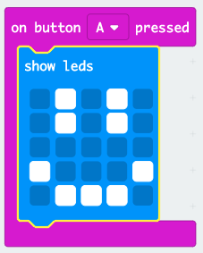

## Wyświetlanie wesołej twarzy

Pokażmy radosną minę na twoim mikro:bit po naciśnięciu przycisku „A”.

+ Do tej pory kod działał tylko wtedy, gdy włączałeś micro:bit. Możesz także uruchomić kod po naciśnięciu przycisku.

Przeciągnij blok „on button pressed” z wejścia i upewnij się, że wybrane jest „A”:

Każdy kod dodany w tym bloku będzie działał po naciśnięciu przycisku „A” na twoim micro:bit.

+ Przeciągnij kolejny blok `show leds` wewnątrz twojego nowego zdarzenia i narysuj szczęśliwy wyraz twarzy.

+ Przetestuj twój nowy kod w emulatorze. Naciśnij przycisk „A”, aby zobaczyć szczęśliwą twarz na swoim micro:bit:

Możesz także przetestować swój nowy kod na micro:bit.