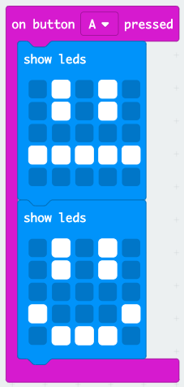

## Tworzenie prostej animacji

Stwórzmy (bardzo) prostą animację dla twoich szczęśliwych i smutnych twarzy.

+ Dodaj drugi blok `show leds` do bloku `on button A pressed` z neutralną twarzą.

+ Jeśli uruchomisz ten kod, aby go przetestować, zauważysz, że wzór zmienia się szybko. Aby zrobić opóźnienie, musisz dodać blok `pause` pomiędzy dwoma wyświetlanymi obrazami.

Aby wybrać liczbę milisekund oczekiwania, kliknij strzałkę w dół i wprowadź liczbę. 1000 milisekund to 1 sekunda, więc 250 milisekund to ćwierć sekundy.

+ Musisz także ożywić swoją smutną twarz. Najprostszym sposobem na to jest zduplikowanie właśnie utworzonych bloków. Kliknij blok prawym przyciskiem myszy, aby go zduplikować. Zauważ, że edytor PXT duplikuje tylko jeden blok na raz (nie wiele bloków jak Scratch).

+ Następnie możesz przeciągnąć te bloki do swojego bloku `on button B pressed`. Twój kod powinien wyglądać tak:

+ Przetestuj swój kod, a po naciśnięciu przycisku A i B powinnaś zobaczyć animowane szczęśliwe i smutne twarze.

