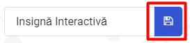
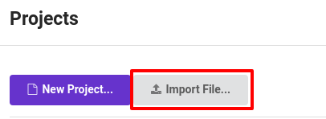

## Afișarea unei imagini

Să începem prin a afișa o imagine pe micro:bit când este pornit.

+ Mergi la <a href="https://rpf.io/microbit-new" target="_blank">rpf.io/microbit-new</a> pentru a începe un proiect nou în editorul MakeCode (PXT). Numește noul tău proiect „Insignă interactivă”.

+ Ar trebui să vezi acum editorul de cod. Pentru a desena o imagine pe micro:bit-ul tău atunci când este pornit, trage un bloc `show leds` din zona de cod (în partea stângă) în interiorul blocului `start`.

+ Pentru a crea o imagine care să fie afișată, dă click pe led-urile pe care dorești să le aprinzi:

+ Codul tău se va executa automat în emulatorul din stânga:

+ De asemenea, îți poți testa codul chiar pe micro:bit! Pentru a face asta, dă click pe „Download” din meniul din partea stângă a ecranului.

Astfel, se va crea și descărca un fișier `.hex` care va rula pe micro:bit-ul tău.

+ Folosește cablul USB pentru a conecta micro:bit-ul în computer-ul tău. Ar trebui să vezi că micro-bit-ul tău apare în manager-ul de fișiere al computerului ca unitate USB. 

+ Dacă folosești uploader-ul micro:bit, atunci fișierul `.hex` va fi copiat automat pe micro:bit. Consultează voluntarul dacă nu ești sigur. 

În caz contrar, va trebui să copiezi fișierul `.hex` pe micro:bit.

Dacă folosești **Internet Explorer**, poți alege `Salvare ca` din meniul care apare în partea de jos a browser-ului tău și apoi selectează unitatea micro-bit:

Dacă folosești **Google Chrome**, poți să dai click pe săgeată după fișierul descărcat și să alegi „Afișează în dosar” și apoi să tragi fișierul evidențiat pe unitatea micro:bit:

+ O lumină de pe partea din spate a micro:bit-ului tău va clipi în timp ce fișierul este copiat. Odată finalizat, programul tău va rula. Poți să dai click pe butonul de resetare de pe partea din spate a micro:bit-ului pentru a reporni programul.

+ Acum ar trebui să vă îți vezi imaginea pe micro:bit. Dacă preferi, poți scoate cablul USB de la micro:bit și să atașezi bateria. Programul va fi salvat pe micro:bit.

Nu ai nevoie de un cont pentru a salva lucrurile! Proiectul tău va fi salvat automat în browser, după care poți da click pe `Projects` pentru a vedea proiectele tale.

De asemenea, poți da click pe salvează pentru a descărca proiectul ca un fișier `.hex` care conține proiectul tău:

Pentru a încărca proiectul tău pe un alt computer, dă click pe „Projects”, „Import file” și mai apoi selectează fișierul tău `.hex`.

