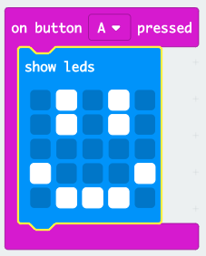

## Afișarea unei fețe fericite

Hai să afișăm o față fericită pe micro:bit-ul tău când apeși butonul „A”.

+ Până acum, ai executat codul doar atunci când micro:bit-ul este pornit. Poți, de asemenea, rula codul atunci când este apăsat un buton.

Trage un bloc „on button pressed” din input și asigură-te că este selectat „A”:

Orice cod adăugat în interiorul acestui bloc se va executa atunci când apeși butonul „A” de pe micro:bit.

+ Trege un alt bloc `show leds` în interiorul noului tău eveniment, iar apoi desenează un model de față fericită.

+ Test out your new code in the emulator. Apasă butonul „A” și ar trebui să vezi o față fericită pe micro:bit-ul tău:

De asemenea, poți testa noul cod pe micro:bit-ul tău.