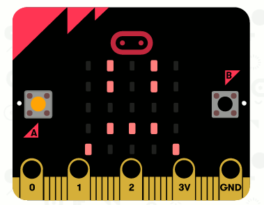

## Crearea unei animații simple

Hai să creăm o animație (foarte) simplă pentru fețele tale fericite și triste.

+ Adaugă un al doilea bloc `show leds` pe blocul tău `on button A pressed`, cu o față neutră.

+ Dacă execuți acest cod pentru a-l testa, vi observa că modelul se modifică rapid. Pentru o întârziere mai mare, va trebui să adaugi un bloc `pause` între cele două imagini care sunt afișate.

Pentru a alege câte milisecunde să aștepți, dă click pe săgeata în jos și introdu un număr. 1000 milisecunde este de 1 secundă, deci 250 milisecunde este un sfert de secundă.

+ Va trebui, de asemenea, să îți animezi fața tristă. Cel mai simplu mod de a face acest lucru este duplicarea blocurilor pe care tocmai le-ai creat. Dă click dreapta pe un bloc pentru a-l duplica. Reține că editorul PXT duplică doar un bloc la un moment dat (nu mai multe blocuri, cum este în Scratch.)

+ Poți apoi să tragi aceste blocuri în blocul tău `on button B pressed`. Așa ar trebui să arate codul tău:

+ Testează-ți codul și ar trebui să îți vezi fețele animate fericite și triste atunci când apeși butoanele A și B.

