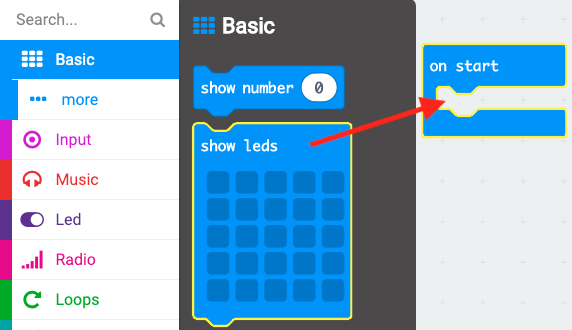

## Displaying an image

Let's start by showing an image on your micro:bit when it's powered on.

+ Go to <a href="https://rpf.io/microbit-new" target="_blank">rpf.io/microbit-new</a> to start a new project in the MakeCode (PXT) editor. Call your new project 'Interactive badge'.

+ You should now see the code editor. To draw an image on your micro:bit when it's powered on, drag a `show leds` block from the code area (on the left) inside the `start` block.

+ To create an image to display, click on leds that you want to light up:

+ Your code will run automatically in the emulator on the left:

+ You can also test your code on the micro:bit itself! To do this, click 'Download' on the menu at the left of the screen.

This will create and download a `.hex` file that will run on your micro:bit.

+ Use the USB cable to plug your micro:bit into your computer. You should then see your micro:bit appear in your computer's file manager as a USB drive. 

+ If you are using the micro:bit uploader then the `.hex` file will be automatically copied to the micro:bit. Check with your volunteer if you're not sure. 

Otherwise you will need to copy the `.hex` file to the micro:bit.

If you are using **Internet Explorer** you can choose `Save as` from the menu that appears at the bottom of your browser and then select the micro:bit drive:

If you are using **Google Chrome** you can click on the arrow after the downloaded file and choose 'Show in folder' and then drag the highlighted file to the micro:bit drive:

+ A light on the back of your micro:bit will flash while the file is being copied. Once this has stopped your program will run. You can click the reset button on the back of your micro:bit to restart the program.

+ You should now see your image on the micro:bit. If you prefer, you can remove the USB cable from your micro:bit, and attach the battery. The program will be saved on the micro:bit.

You don't need an account to save your stuff! Your project will automatically be saved in the browser, you can click on `Projects` to see your projects.

You can also click save to download your project as a `.hex` file which contains your project:

To load your project on another computer, click 'Projects' and then 'Import file' and select your `.hex` file.

